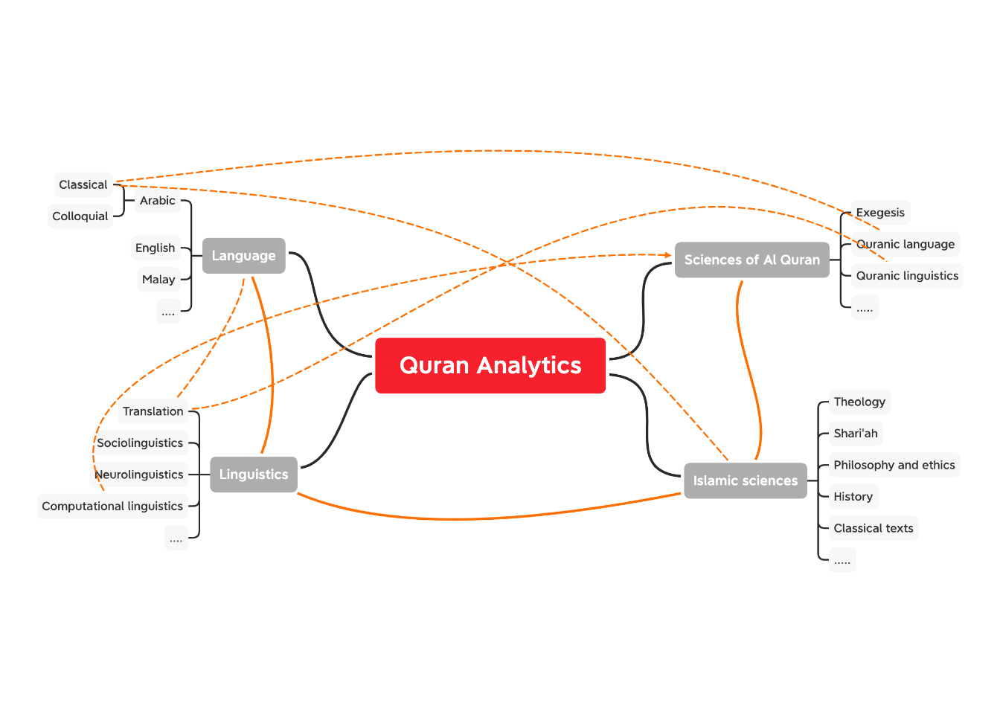

# Introducing Quran Analytics {#introducing-quran-analytics}

> Prophet Muhammad (SAW) said, “The best of you are those who learn the Quran and teach it.” [Bukhari]

Learning and teaching Al-Quran is one of the greatest virtues in Islam. It is an obligatory duty of a Muslim. The methods of learning Al-Quran have been passed down from generation to generation and continue to flourish even to this day. The methods of learning Al-Quran had always been in the original text of Al-Quran, which is the Quranic Arabic; whether it is about learning to read or learning to understand.

With advancements in technology, is it possible for the new generation to learn Al-Quran beyond the traditional methods and tools? Does the digital revolution allow us to use technologies for learning and teaching Al-Quran? The answer is most clearly a yes. However, people with knowledge of technology understand that the use of technology is beyond just browsing webpages and manipulating mobile applications within our devices. It is also beyond simple webpage creation and publication of YouTube videos. All these means of teaching and learning, while laudable, bring along many unintended consequences.

The question we want to pose is, is it possible to put everything about teaching and learning Al-Quran as a comprehensive and all-encompassing system using digital technology of the day? If this quest is possible, then we must start the subject right from the very beginning - that is to cast the objective of the envisaged system within the domain of scientific discovery.

The logic of knowledge (or scientific discovery) provides an analysis of testing systems of theories against experience by observation and experiment [@popper1992]. Analyzing is one mechanism to produce reliability based on evidence. Evidence comes in the form of data, and testing is through inference. Inference, on the other hand, is understood through the theory of probability.

The question is, can we put the same rigor of testing Al-Quran as a way for us to get to the truth or true belief? Al-Quran to Muslims is a sacred religious text, the “word of Allah,” a divine revelation, and is the final truth. For many Muslims, Al-Quran studies must be through traditional learning and knowledge discovery methods. First and foremost, we hold to the view that as Muslims, believing in the finality of the truth of Al-Quran is one of the pillars of our faith; and there is no question about it. Therefore, we believe that the question of “testing” the truth of Al-Quran does not arise; in fact, it should reaffirm any believer in the veracity of its truth.

The basic principle must be that what we seek is knowledge itself. Knowledge and discovery of knowledge do not have any limit. As a believer, we must have a firm belief in the miraculousness of the language of Al-Quran; but to be able to appreciate this miraculousness with reason is what we lack. Without formal training in the Classical Arabic language and Islamic studies, many of us are at the mercy of those who claimed authority over the subject. Is there a way for those in this category to acquire this knowledge using modern tools, directly from the original and classical sources of the Quranic knowledge? Answering this is what Quran Analytics is all about.

Modern tools in knowledge discovery and acquisition are computational methods, data science, artificial intelligence, and algorithms - combined with scientific methods of analysis and domain expertise - applied in computing environments. Examples of this are information retrieval, knowledge extractions, knowledge graphs, and many other applications in various fields of studies in natural and social sciences. The web, as we know it today, is a massive body of information and knowledge. Extracting knowledge from the web is impossible without relying on these modern tools.

Quranic knowledge is vast from many aspects; “the language is a captivating beauty, boundless expressiveness, eloquence, rhythm, magic, and distinction.”[@saeh2015] It benefited from the “turath” of many scholars of the past with voluminous texts. These scholars came across many geographic regions of the world over more than one thousand years. The question is, how do we gain knowledge from this vast sea of knowledge? The answer is, we need modern tools for knowledge acquisition in the form of Quran Analytics.

The earlier scholars of Islam's approach to Quranic knowledge were eminently clear. They start with a thorough mastery of the language, and secondly through the acquisition of knowledge via memorization of everything in its original form (i.e., language in words and speech, as well as in context) and from total comprehension of knowledge through understanding the various teachings. However, as time progresses, the subject of language is becoming more distant, especially for many of the non-Arabic speaking people (due to the language barrier) and Arabic speaking people (due to diglossic behavior). The distance of Quranic knowledge from the people is growing.

Furthermore, the path of knowledge development among the early Islamic scholars took different trajectories; for example, there are distinct paths taken among scholars from the Arabic peninsula, the Levant, Central Asia, North Africa, the Turk regions, the sub-continent, and Southeast Asia. As the knowledge is being transmitted and spread, many changes happened, and the eventual form of understanding may have diverged significantly. An example of this is the Mazhabs (sects), wherein Southeast Asia ascribes to Shafie, the Persians to Shi'a, the Turks to Hanafi. Tracing these various paths of knowledge development by itself is a significant task, not counting the content and context of the knowledge itself.

Written texts possess something that others do not, namely, it is a form of data and carries the language with the contexts and meaning and knowledge dissemination. With advancements in computing, these texts are available in digitized form and further digitalized in a machine-readable format. With the advancements in the tools of annotation and textual analysis together with Big Data availability, the process of analyzing becomes less daunting.

Quran Analytics is a new term without a clear scholarly definition. We know that it is a combination of various disciplines - including Quranic sciences (Ulum Al-Quran), language and linguistics, and broader Islamic sciences. The relationship and interdependencies between these fields are both _complicated_ and _complex_. Our exploratory attempt to provide a diagrammatic relation between the various fields of knowledge is shown in Figure \@ref(fig:ch1fig1).

(\#fig:ch1fig1)Complexity of Quran Analytics

The "relationships" shown are examples of the relations and intersections of multi-disciplinary requirements for Quran Analytics.

The vast subject of Quran Analytics is our broad domain. We cannot cover all in the current work. Instead, in this book, we would like to start introducing Quran Analytics, focusing on selected areas. We intend to start and spur the development of Quran Analytics as a new field of study, and this book is our introduction to the subject.

## Quran Analytics {#quran-analytics}

Our search for the term "quran analytics" in Google Scholar, yields 2,480 results; and a similar search for "bible analytics" yields 19,500 results.^[Search performed on 27 January 2021, using https://scholar.google.com/] In both cases, we could not find a clear scholarly definition of the terms used. In the case of the Bible, for example, one interesting site we found is Aver Analytics,^[https://www.averanalytics.com/bible-dashboard] where they perform annotations of the King James (English version) Bible and convert the text data into visuals, for the purpose of learning. For the case of Quran Analytics, the main site is from qurananalysis,^[https://www.qurananalysis.com/analysis/] which is the product of research works by the School of Computing team at the University of Leeds, United Kingdom. The site claims to be "the swiss-knife of Quran Research" for both Arabic and English languages.

The most comprehensive reference that we found on the subject is based on the works of Prof. Eric Atwell and his students at Leeds University. Over a decade, they have been working on annotating the Quranic texts in Arabic, using the Buckwalter transliteration engines for Arabic textual language, generating various statistical measures for the Quranic words, and creating meta-data for words and verses of the Quran. While there are many recent scholarly articles such as publications of the peer-reviewed Journal of Qur'anic Studies by the University of Edinburgh, Quranic Analytics is a subject not extensively covered; whether it is labeled as "Quran NLP", "Quran Analytics", or anything similar. After reading and scanning the works, we still could not find definitive definitions of Quran Analytics.

In the absence of a clearly defined terminology, we propose that the term, Quran Analytics, means the works of combining the science of Quranic studies, language and linguistic studies, and computational linguistics, for the knowledge acquisition and extraction from the Quran.

Defining exactly what is meant by Quran Analytics will be a major challenge; a subject which we intend to develop and expand extensively in our research. For now, we would say that our approach to Quran Analytics is about utilizing the tools of computational linguistics applied non-parametrically to the studies of the sciences of Al-Quran. What we mean by non-parametric is that, by design, the analysis does not assume any pre-existing models of the sciences of Al-Quran. Another way to express this is akin to the terminology of "unsupervised learning" in machine learning algorithms. And borrowing the term from network or graph theory, we perform analysis to allow self-emergent structures to emerge and be detected in the process.

Where this approach will take us to is still uncertain. However, the encouraging development is, for many complex tasks in computational linguistics such as information retrieval and knowledge extractions, using unsupervised learning, knowledge graphs (both are non-parametric methods), are among the major discoveries of recent time. This is largely aided by the availability of Big Data, faster computing capabilities, accuracies of newer algorithms, and advancements in network science.

## Quranic Studies {#quranic-studies}

Traditional studies of Al-Quran are through the Arabic language, the science of Quranic studies (Ulum al-Quran), and the exegesis (Tafseer) of Al-Quran. The methods go back to the early period of Islam and are passed down to modern times. It is an extensively developed field which in early days were dominated only in the Arabic language, until recent times when translations to other languages such as English were made. There exist large corpora of text, in Arabic, for various exegesis, commentaries, etc., aggregated from more than one thousand years of development. All of the writings have been preserved and nowadays available in digital forms.

Anyone studying Al-Quran knows that to be able to read and comprehend all possible exegesis and commentaries for the Quran is a major task even for a scholar in the field. For people without proficiency in the Arabic language, the task is even harder. Only recently, for example, Tafseer Ibn Kathir is translated to English and other languages from its Arabic origin. Translating is not an easy effort, since it is often subjected to the translators' own views and biases.

One of the approaches to Quranic studies is to express it as literary texts within linguistic contexts. While the approach is novel, it is highly criticized by some traditional Islamic scholars as violations of Islamic principles, since the Quran is the "word of God" and not some literary piece. There is a lot of truth in this criticism, especially when it is studied in non-Quranic Arabic forms of language, which includes colloquial Arabic and non-Arabic languages. Furthermore, as emphasized by early scholars of the sciences of Al-Quran, the knowledge from the Quran must be viewed as a holistic approach, rather than analyzing their grammar, lexicography, content, and implications within sentences (verses) and a group of sentences (verses).

In this regard, the arcane Computational Linguistic (CL) approach to Quranic studies, will be highly criticized since it might not adhere to the established methods and rules. Therefore there is a serious need for __combining the sciences of Quranic studies with CL__, whereby CL is only used as a tool for performing the studies, and not the primary method. In other words, CL on Al-Quran requires first and foremost, the sciences of Quranic studies as a field of knowledge and then CL as a tool of computing and processing the texts.

Our view is that, to date, most of the incomprehension of CL applications to the Quranic studies comes from the lack of understanding of scholars of the CL subject itself. CL is only good as a tool, which follows the rules imposed by the designer or developer of the tools. Properly designed tools will serve their purpose. An example of this is the application of CL tools for the Chinese language and literary texts. Developers of Chinese CL tools have to reconstruct the engines of their CL application to perform with high accuracy. In other words, any computing solution is not "model-free" and therefore requires an intense modeling process. The sciences of Quranic studies and the science of Quranic Arabic from classical sources are a good start to derive these CL rules. This field has not been extensively developed, and hence we intend to expand the research and development of the applications of CL to the science of Quranic studies.

## Quranic language and linguistic studies {#quranic-language-and-studies}

Language studies is a very old field, as old as humanity itself. Language as a subject is difficult to describe in simple terms, as it is interrelated with many fields of literature, philology, anthropology, sociology, as well as biology. The Quranic language furthermore is unique in the sense that, we believe that it is the word of Allah, revealed through Prophet Muhammad (SAW), in Arabic language, one thousand two hundred years ago. As a language, traditional and contemporary scholars have argued that the Quranic language stands alone, apart even from the Classical Arabic of the time, and distinctly clear from the Colloquial Arabic.

Our position is that the Quranic language has to be the first priority in the pecking order. It should be the rule which governs the meaning of the language. As an example, the Quranic language uses the "past tense" in English meaning something that is perpetual (e.g. the word "kaana"), in which case, its common usage of Arabic grammar (Classical or Colloquial) will never be the same as Quranic Arabic. Al Quran also introduces new terms and names or gives meanings to these terms and names. The same term and meanings do not change in Quranic Arabic but may change in the usage in the society (i.e. natural language). An example of this is "Riba". A recent reference on the subject is found in [@saeh2015].

Since the subject of Quranic language is beyond our scope here, we simply state our stand on it, namely: the Quranic language is unique and stands by itself (as a mu'jizah), hence it must be treated as such. Our task and duty are to rediscover and uncover more of its uniqueness and meaning, through the knowledge extraction process of Quran Analytics.

Linguistics is the scientific study of language. It involves an analysis of language form, language meaning, and language in context, as well as an analysis of the social, cultural, historical, and political factors that influence language.^[https://en.wikipedia.org/wiki/Linguistics] It is a vast field of sciences, with research covering the sub-field of sociolinguistics, neurolinguistics, translations, and many others. A particular field of interest for us is the latest development in computational linguistics. Our current focus will be on the applications of computational linguistics for Quranic studies.

## Computational Linguistics {#computational-linguistics}

_"Computational linguistics is the scientific and engineering discipline concerned with understanding written and spoken language from a computational perspective, and building artifacts that usefully process and produce language, either in bulk or in a dialogue setting. To the extent that language is a mirror of the mind, a computational understanding of language also provides insight into thinking and intelligence. And since language is our most natural and most versatile means of communication, linguistically competent computers would greatly facilitate our interaction with machines and software of all sorts, and put at our fingertips, in ways that truly meet our needs, the vast textual and other resources of the internet."_^[https://plato.stanford.edu/entries/computational-linguistics/]

The quotes above from the Stanford Encyclopedia of Philosophy reflect the definition of computational linguistics (CL) as a (sub) field of linguistics. The focus of CL is to perform syntactic parsing, word disambiguation, semantic representation and interpretation, making sense of textual representation, and acquisition of knowledge from the language (texts or speeches). The philosophical basis of CL originates from the works of Noam Chomsky, under the generative grammar theory, which claims that grammar in languages follows innate grammatical structures.

The importance of this philosophical basis is to provide scientific justification for us to convert words and sentences into data, through the filters of grammatical rules. Once this is performed, then we will be able to carry out analytical works using traditional tools of probability and statistics. For this reason, in the early days, the subject was called “statistical linguistics”, which today is transformed to “statistical Natural Language Processing (NLP)”, or “Natural Language Processing”.

## Natural Language Processing (NLP) {#natural-language-processing}

Natural Language Processing (NLP) is a combination of linguistics and data science analyzing large amounts of natural language data which includes the collection of speeches, text corpora, and other forms of data generated from the usage of languages. The speeches and text corpora come from official and formal sources (e.g., formal speeches, textbooks, etc.) as well as usage in common day-to-day communications (e.g., usage in social media).

NLP has been largely developed over the last few decades and gained large popularity in part due to the development of various algorithms for language processing - from text mining, development of large corpora, all the way to the development of AI applications to language.

The basics in NLP generally cover text parsing and mining, lexical and grammar analysis, semantic analysis. The higher-order works in NLP are pragmatic analysis, sociolinguistics, Machine Learning, and Artificial Intelligence on linguistics - which in turn are used in a variety of applications - from the simplest such as chatbots, all the way to information retrieval and knowledge extraction.

Most text mining is done on ASCII-based alphabets based on UTF-8 Unicode encoding of characters. Particularly, almost all programming languages are based on the English language for its syntax, which drives the easiness of text mining applied to similar characters which are normally or universally used in a computing environment. Despite the availability of UTF-8 for Arabic characters, text mining is just beginning and is still way behind in comparison to the English language. The most important area which is almost relatively unexplored is on cross-language and multi-language text mining, between Arabic and English, Arabic and Malay, Malay and English with particular focus on sacred religious text such as Al-Quran and Al-Hadith.

## Programming language in NLP {#programming-language-in-NLP}

Google Trends represents an "unbiased sample" of Google search data, which was made available to the public, representing trillions of searches on the Internet that take place every year. The strength of the tool lies in the availability of historical data, granularized to the details of time (daily) and geographic location (cities) for the whole world.^[Google Trends: (https://medium.com/google-news-lab/what-is-google-trends-data-and-what-does-it-mean-b48f07342ee8)] We will use this tool for exploratory views on the usages of computer programming languages in Natural Language Processing (NLP).

Google search for "Top programming language for NLP" reveals that it revolves around five programming languages: MATLAB, R, Python, and Java.^[Google search on 24 January 2021] Further inspection of trends shows that Python is the most popular by far overtaking all other languages combined.^[Google trend analysis on 24 January 2021. The search was done on the trends of "web search" on "MATLAB NLP", "R NLP", "Python NLP", and "Java NLP" as the search term for the whole world for the past 5 years.] Leading the trend was "Stanford NLP" in Java since Java was used in the Stanford NLP project, "PyTorch" and "spaCy" for Python, since "PyTorch" and "spaCy" are the two most comprehensive and usable libraries for NLP works in Python, and the highest rise of usage is from China. For R, "NLP in R" is the only notable term, reflecting R's lack of a single comprehensive package for NLP.

Stanford CoreNLP, which is among the most comprehensive NLP projects to date and was originally written in Java, now uses Python as its official engine under Stanza. Nevertheless, it can be used by almost all other major programming languages such as PHP, C#, Perl, Ruby, and R.

The latest trends indicate that interest in NLP among the programming languages is very encouraging. Google search for the term "NLP in" is tabulated as follows:^[Search on 24 January 2021]

| The term          | Results     |
|-------------------|-------------|
| "NLP in R"        | 43 million  |
| "NLP in Python"   | 20 million  |
| "NLP in Java"     | 9.9 million |
| "NLP in MATLAB"   | 1.47 million|

Regular expressions, also called _regex_, is an extremely powerful tool for computational linguistics. It is a programming language of its own, which relies on the logic of strings manipulations at the byte level. Regex allows the programmer to manipulate the texts at the rudimentary level, whether to do character search (using byte search) or removal/replacement of characters from text sources based on any structures.

The drawback of regex however is its logic and highly cumbersome codes. Availability of string manipulations libraries, such as "spaCy" in Python or "stringi" in R, makes the use of regex less important in these languages. The basis of the logic applied in most of these libraries originates from regex. This is why regex could prove to be extremely useful in dealing with languages that are not based on Latin-based scripts such as Chinese or Arabic scripts.

The latest trends in programming languages for NLP are encouraging where most solutions are aimed at inter-operability across computing platforms. This is accomplished through the development of Application Programming Interfaces (APIs) and extending the programming language to other languages. For example, TensorFlow which is made famous in Python is extended into R via Keras interface to R. Similarly, many built-in functions which are written in the C++ language are in use by Python, R, and Java. In the future as well as now, the need to be conversant in all programming languages may not be important; as long as one is familiar with any particular popular language, extending it to applications in another language will be straightforward. 

## Advancements in NLP and Quran Analytics {#advancements-in-NLP-and-quran-analytics}

Advancements in NLP over the last decade have progressed from simple and basic tasks into Machine Learning, Deep Learning, and Artificial Intelligence with significant success in achieving many complex and complicated operational goals. One of the key areas of success is in transforming data into knowledge. With large amounts of unstructured data, it is extremely difficult to process and convert those data into meaningful representations that humans can derive useful conclusions from. What the machine does is to take as input large amounts of data, process them in machine forms using rules generated by NLP tools, and finally present them to humans with the domain knowledge, to interpret them for people with less expertise of the domain concerned.

An example of this is anomaly detection, where given large amounts of data (for example collections of Quranic exegesis), the only way for a human being to detect any "false interpretation" is by reading the texts in detail of all possible collections of exegesis which are considered authentic. The checks must involve all aspects, all possible sources of the interpretation, the methodology used in any specific exegesis, exact context and contents of the interpretation, contextual issues in linguistics, and all relevant notes and pointers attributed by the interpreter. Given the vast amount of exegesis available, what had been done traditionally is to commit everything to memory, and checks are done through memory. Why is this the only possible method? Because even readings on a textual basis will miss small details of anything - such as the exact context of the interpretation, the references used such as other verses, Hadiths, and traditions used. This is almost humanly impossible today (except for whoever is given gifts of memorization). Is it possible to use the advancements in NLP to perform this feat? This is an example of applying NLP to a problem in Quranic interpretations.

There are many examples of recent achievements in NLP which are extremely encouraging for a wide range of applications within common usages, such as speech recognition, speech-to-text, information retrieval systems, and others. Since our objective here is to introduce Quran Analytics, we will cover some of the advances particularly towards its potential applications within this field. We must admit that the coverage about NLP is very wide and encompasses many domains, therefore our suggestions here remain a preliminary exploration of the subject matter. For further readings on the subject, we recommend that readers refer to the materials suggested at the end of the chapter.

### Common NLP tasks {#common-NLP-tasks}

Common NLP tasks are generalized into the following:

1. Properties of natural language - which include phonetics, phonology, syntax, grammar, lexicon, and its variations.
2. Morphology - Part of Speech (POS), lemmatization, and affixations.
3. Semantics - phrase structure, sentences and utterances, relations, thematic, and others.
4. Pragmatics - discourse, intentions, implications, and others.

All the tasks listed above are cast within the linguistic domain, which is based on the notion that language is "generative" in nature. This implies that natural language, whether in the form of speech or textual, is convertible to machine-readable form as data. Once the natural language is converted to data, various algorithms and computing models are applied to generate the tasks in an inference framework. This framework is called "Statistical Natural Language Processing". There are many established references for NLP as a subject, notable among them are @manning1999, @manning2009, @jurafsky2000.

The key aspect of NLP is the statistical analysis, and the tools for it are available in abundance. However, the deeper meaning of the text and inference language is context-dependent. For the English language, this area has been well developed over many decades. Whilst for other languages, it is unclear, particularly the Arabic language, which has its diglossia of colloquial Arabic and Classical Arabic. The Malay language is similar, with its own diglossic dichotomy between Malaysian Malay and Indonesian Malay. All these deeper dimensions may confound statistical inference, and many inferences may suffer from small sample problems.

Lexical analysis is one of the most advanced areas in NLP, due to the digitalization of language as textual data. Lexical analysis relies on two major steps:

a) lexicalization which includes _tokenization_, _lemmatization_, and _word cleaning_ process, and 
b) analyzing the objects (in this case tokens), within their contexts, such as _syntactic structures_, _grammar analysis_, and others.

Semantic analysis is about relations between structures derived from the data as an outcome of lexical process or engines into the phrases, clauses, sentences, group of sentences as well as the whole text and corpora.

Among the early works for NLP is corpus building. The task is to convert text and generate a large corpus of speech and textual data. There are many notable efforts for public corpus development such as Project Guttenberg^[https://www.gutenberg.org], American National Corpus^[http://www.anc.org], British National Corpus^[https://www.english-corpora.org/bnc/], BYU corpus linguistics^[https://lcl.byu.edu], and others. A good list is available on Wikipedia.^[https://en.wikipedia.org/wiki/List_of_text_corpora] A paid version program for corpora in many languages is developed by Sketch Engine^[https://www.sketchengine.eu] which has a variety of language capabilities. A sample list for Arabic language corpora is provided by Eddakrouri.^[https://sites.google.com/a/aucegypt.edu/infoguistics/directory/Corpus-Linguistics/arabic-corpora]

In the past decade, most programming languages have expanded their capabilities to deal with most programming tasks. Furthermore, the works by groups like Stanford NLP, IBM, Google, Baidu, as well as Facebook, generated many language models and treebanks. For example, Stanford NLP through Stanza provided language models for almost all major languages of the world.^[https://stanfordnlp.github.io/stanza/available_models.html] For treebanks, the famous one is the Penn Treebank project of the University of Pennsylvania, ^[https://web.archive.org/web/19970614160127/http://www.cis.upenn.edu/~treebank/] which includes a variety of languages including the Arabic language.^[https://catalog.ldc.upenn.edu/LDC2005T20] Of late, is the development of semantic treebanks, which are collections of natural language annotated with meaning representations. An example of this is the Groningen Meaning Bank^[https://gmb.let.rug.nl] by the University of Groningen, Netherlands.

### Available resources for digital Quranic studies 

Of particular interest for the work in Quran Analytics is the developments in Arabic NLP with a special focus on Classical Arabic. The interest and works in Arabic NLP have only recently started and much more work is still needed. Among the key problems is the availability of standardized Arabic corpora for Modern Standard Arabic.[@larabi2018] One of the major limitations for Quran Analytics is the limited availability of resources since Arabic is considered as a "low resource language" in NLP, as compared to "high resource languages" such as English, French, Spanish, German and Chinese.^[@hirschberg2015] Also, corpora for classical Islamic texts have just begun. A full survey is provided by [@atwell2018]. The most notable project is by King Saud University Corpus of Classical Arabic, which derived most of its texts from Al-Maktabah Al-Shamelah.^[https://shamela.ws] It contains Classical Arabic texts from the early stage of Islamic history to modern times.^[The site contains over 6,000 texts totaling around 1 billion words. Many of the texts are accessible in https://github.com/OpenArabic/]

Since the last decade, many solution providers have developed Quranic studies using web applications or dedicated applications, made available to the public. Notable among them is the Quran corpus project from Leeds University, under _Corpus Quran_.^[https://corpus.quran.com] Their effort is highly extensive, since they performed massive efforts in annotating the Quran Arabic from its Uthmani scripts, and created the treebank, ontological graphs, grammatical expressions, as well as its English translations. The web page, as well as the data, has been made as open-source under _Quran Analysis_, ^[https://www.qurananalysis.com] and _Text Mining the Quran_.^[http://textminingthequran.com]

_Quran Gateway_ ^[https://info.qurangateway.org/about/] is another digital effort, which is provided as a paid version, developed originally by Dr. Andrew Bannister and Dr. Daniel Brubaker. The theme of their works is based on "An Oral-Formulaic Study of the Quran", originally a Ph.D. thesis that was published as a book in [@bannister2014]. The approach is by taking NLP methods and applying them to the studies of Al-Quran, using both the original Quran in Arabic and various English translations.

Thus far our research reveals that these are the only two works that qualify as comprehensive works on Quranic studies which deploy NLP computing tools for its development. Between the two, the work from the Leeds University working group is more comprehensive and covers a wider range of applications, and was made to be open source. Quran gateway on the other hand relies on a specific method (or models) which opens it to criticism as narrow-based solutions.

As far as compilations for the translations of Al-Quran, most of the texts (i.e., corpus) are available from www.tanzil.net for various languages. 

### NLP works on English translations of Al-Quran 

Since the most accessible NLP libraries are in the English language, we will focus first on the English translations of Al-Quran. In particular, we will do some simple analytics using two English translations of Al-Quran, namely _The Meaning of the Holy Quran_ by Abdullah Yusuf Ali [@yusufali2003] and _The Quran: Arabic Text with Corresponding English Meanings_ by Saheeh International [@saheeh1997]. There are other translations such as by A.J. Arberry, Abul Ala Maududi, Pickthall, and a few others. The texts are available for download from www.tanzil.net and other sources. In this book, we will focus mainly on Saheeh and use Yusuf Ali for comparisons. A full work encompassing all other translations is left for the future.

For the English language resources, there are many available models for syntactic, lexical, and treebanks, which are openly accessible. The most notable ones are Stanza NLP from Stanford NLP group, Penn Treebank, as well as Udpipe. We will be using Udpipe because of its easy access within __R__. In the future, we will also use other ready-made libraries for the English language for comparisons.

Furthermore, among the libraries for sentiment scoring models, the English language provides many open libraries for usage. Among the notable ones are the "bing sentiment model" (from Bing Liu and collaborators), "AFINN sentiment model" (from Finn Arup Nielsen), "Stanford Sentiment Treebank" (from Stanford NLP group), "nrc sentiment model" (from Saif Mohammad and Peter Turney). We will use bing and AFINN in our work here.

The most notable NLP work on English translation is from the University of Leeds, as indicated earlier. However, the work is just at the beginning stage. Many of their works are available online at www.corpus.quran.com. 

### Complex NLP tasks for Quran Analytics

In our view, the bigger challenge for Quran Analytics will be in the new advancements of NLP, particularly in the area of information extraction, active learning, augmentation mining, knowledge graphs, knowledge base systems, and probabilistic language modeling. These are among the actively researched areas in NLP. 

Information extraction is a technique of extracting structured information from unstructured text. This is a difficult problem due to the complex nature of the human language, whereby words have different meanings when put in different contexts. Active learning on the other hand is important for the tasks of automation in annotation works - which reduces the time for high accuracy annotations tasks. A knowledge graph is a way of storing data that resulted from an information extraction task. It transforms the information data into what is termed a "graph database" concept. Argumentation mining focuses on analyzing argumentation in text and developing tools to automatically extract, aggregate, summarize and reason about arguments in natural language. This in turn provides tools for inference and predictions.

Knowledge base systems (KBS) involve the creation of algorithms that use knowledge for solving complex problems. An example of this is a set of knowledge settings, such as Islamic rulings (fatwas); a KBS for this purpose is a system of collection of knowledge on all resources relating to the basis of rulings (i.e., Al-Quran, Al-Hadith, etc.). Finally, probabilistic models of language deal with fundamental cognitive questions of how humans’ structure, process and acquire language. Applications of Deep Learning algorithms and complicated language modeling such as Hidden Markov Models (HMM) are entrenched in this domain.

There are numerous other areas of development within the field of NLP which are not possible to be covered here. What's important is that all these advancements provide massive learning examples which give researchers new and novel methods of exploring NLP further. We are sure that these learning examples are useful tools and resources for Quran Analytics as we envisaged.

## Why use R? {#why-use-R}

In this section, we will argue for __R__ programming language as our tool of choice. __R__ is a GNU project, which is a major advantage for many developers and collaborators to join their efforts in developing programs and solutions to common tasks. Only two programming environments have reached a large following in terms of users and contributing collaborators in the field of data science, __Python__ and __R__. Which language should you learn? The decision can be challenging because both Python and __R__ have clear strengths.^[https://www.r-bloggers.com/2021/02/r-is-for-research-python-is-for-production/]

R is exceptional for research – visualizing the data, telling the story, producing reports, and making MVP (minimum viable product) prototype apps with Shiny. From concept (idea) to execution (code), R users tend to be able to accomplish these tasks 3X to 5X faster than Python users, making them very productive for research. Python is exceptional for production – integrating machine learning models into production systems.

__R__ originated as a statistical programming language. This is the reason why it is favored by scientists and researchers more than Python, which is geared more towards programmers. However, it really does not matter which one to choose between Python and __R__, since both are highly interoperable. What is needed is high proficiency in at least one. Most libraries available in Python will have their equivalent in __R__, and vice versa. If it is not available in one, you can simply run the Python program in __R__ directly.

We view that in computational linguistics, in particular NLP, __R__ is well-positioned to undertake the heavy lifting works required. In particular, the flexibility of __R__ as a Massively Objected Oriented Programming (MOOP) language with its advanced data structures, gives us flexibility to construct our own data structures fitting the problem at hand. This will become handy when we deal with complex concepts and methods for the Quranic language, in particular the Quranic Arabic. As far as the Arabic scripts are concerned, they can be dealt with quite easily; and usage of regular expressions is extremely straightforward in __R__.

More importantly, developers have built massive libraries (called packages) in __R__, from a very broad discipline of subjects and applications. As of today, there are more than 10,000 packages that have been developed and maintained by CRAN, which is the common __R__ codes repository, available for download and usage. Of course, this is a far cry from Python, which has more than 200,000 packages, hosted by PyPI. The advantage of __R__ and _CRAN_ is that all packages in the repository are well maintained, versioned, and well documented. In __R__, the most popular IDE (Integrated Development Environment) is _R Studio_, which is easy to use, and all documents are designed for reproducibility through _R Markdown_.

Lastly, we would argue that as far as NLP is concerned, __R__ represents the most vibrant alternative to Python, and is used widely by many NLP researchers and developers as a tool of choice. This is evident from the search results in the previous section which shows that interest in "NLP in R" is almost double the interest in "NLP in Python". Since __R__ is more attuned to researchers and scientists, we will take R as our programming language of choice. For a good introduction to __R__, we recommend "R for Data Science" by Wickham and Grolemund [@wickham2016], its online version is also available,^[https://r4ds.had.co.nz] and "R Programming for Data Science" by Roger Peng [@peng2014], with its online counterpart.^[https://bookdown.org/rdpeng/rprogdatascience/]. For a good course on R is from Coursera.^[https://www.coursera.org/specializations/data-science-foundations-r]. A full exposition of the R programming language is  "Extending R" by [@chambers2016].

## Focus of this book {#focus-of-this-book}

The purpose of this book is to guide our readers along with the exploratory data analysis (EDA) step in data science.^[https://r4ds.had.co.nz/]. The datasets we will explore are mainly the selected English translations of Al-Quran. The methods of the exploratory analysis will be the various tools available, mainly using __R__ programming language. This is intended as a first step before we will apply it within a larger context of applications on the original language of Al-Quran, which is in the Uthmani script and based on Al-Quran Classical Arabic, relying on various classical Islamic texts, such as the Hadith, Tafseer, and others which are based on Classical Arabic.

We intend to achieve three indirect objectives in this book:

1. To indirectly introduce R programming language as a data science tool.
2. To introduce some of the NLP tools in R.
3. To explore some of the NLP concepts for text and data analysis.

The more direct objectives of our exploratory work are to:

1. Demonstrate the usage of various tools within the context of the English language for the Quran English translations and provide indications in terms of applications within the original text of Al-Quran.
2. Suggest various paths of research and development that can be further expanded based on the lessons learned from dealing with the English language. These are noted at the end of each chapter as conclusions providing further direction of research.
3. Showcase various existing open-source models of language, in particular the English language. This will be shown through various comparative analyses.

Most importantly, we hope that our work will spur more interest among researchers and collaborators to further investigate and expand the area of Quran Analytics, Natural Language Processing, Linguistics, in totality and comprehensively. It should encompass the domain of English language (for the case of English-speaking people), Malay language (for southeast Asian Malays), and hopefully other languages such as Farsi, Turkish, Chinese, Bangladeshi, Hindi, and numerous other major languages that have their Quran translations.

## Further readings

Atwell, Eric. _Classical and Modern Arabic Corpora: Genre and Language Change._ John Benjamins Publishing Company, Amsterdam, The Netherlands, 2018. [@atwell2018]

Baayen, Harald R. _Analyzing Linguistic Data: A Practical Introduction to Statistics Using R._ Cambridge University Press, Cambridge, United Kingdom, 2008. [@baayen2008] 

Chambers John M. _Extending R._ Chapman Hall/CRC, Boca Raton, Florida, 2016 [@chambers2016]

Gries, Stefan T. _Quantitative Corpus Linguistics with R: A Practical Introduction._ Routledge, Taylor & Francis Group, New York, New York, 2017. [@gries2017]

Izutsu, Toshiko. _God and Man in the Qur'an._ Keio University, Tokyo, Japan, 1964 [@izutsu1964]

Jurafsky, Daniel and James H. Martin. _Speech and Language Processing: An Introduction to Natural Language Processing, Computational Linguistics, and Speech Recognition._ Prentice Hall, New Jersey, United States, 2000 [@jurafsky2000]

Manning, Christopher D. and Hinrich Schutze. _Foundations of Statistical Natural Language Processing._ The MIT Press, Cambridge, Massachusetts, 1999 [@manning1999]

Manning, Christopher D., Prabhakar Raghavan, and Hinrich Schutze. _An Introduction to Information Retrieval._ Cambridge University Press,  Cambridge, England, 2009. [@manning2009]

Peng, Roger D. _R Programming for Data Science_. Leanpub, Victoria, British Columbia, Canada, 2014. [@peng2014]

Rahman, Fazlur. _Major Themes of the Qur'an._ The University of Chicago Press, Chicago, Illinois, USA, 1980. [@rahman1980]

Saeh, Bassam. _The Miraculous Language of Qur'an: Evidence of Divine Origin._ International Institute of Islamic Thought, London, United Kingdom, 2015 [@saeh2015]

Von-Denfer, Ahmad. _Ulum Al-Quran: An Introduction to the Sciences of the Quran._ The Islamic Foundation, London, United Kingdom, 1983 [@vondenfer1983]

Wickham, Hadley and Garret Grolemund. _R for Data Science._ O'Reilly Media, Inc, Newton, Massachusetts, 2016. [@wickham2016]

