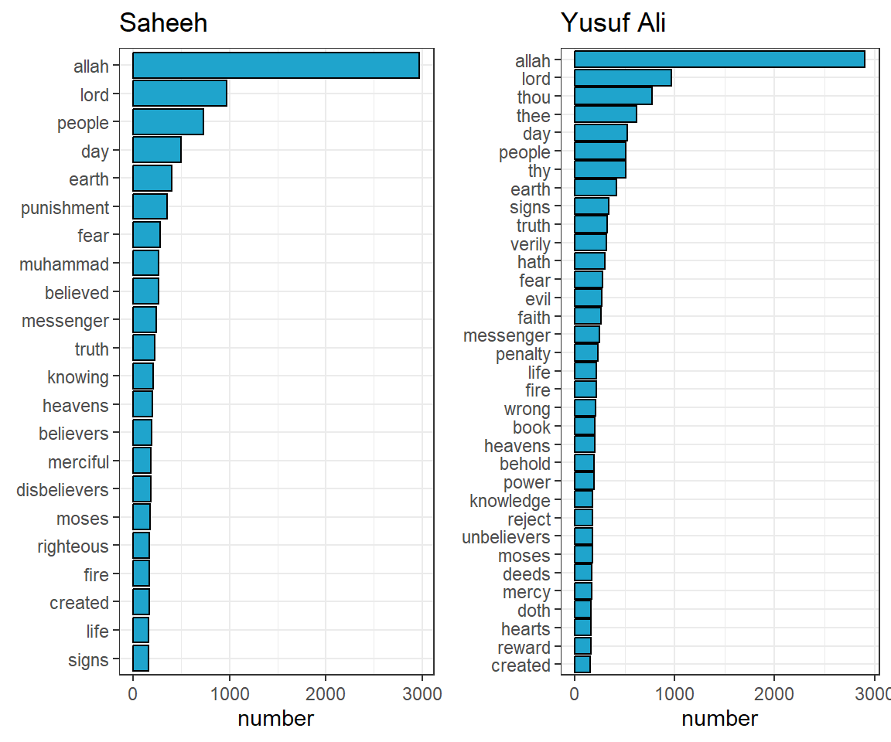
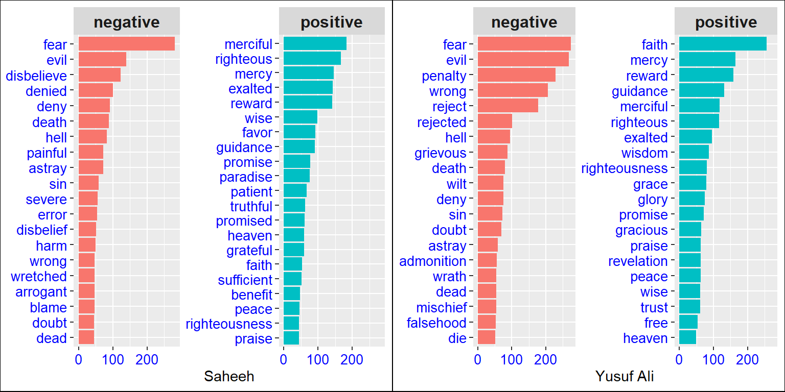
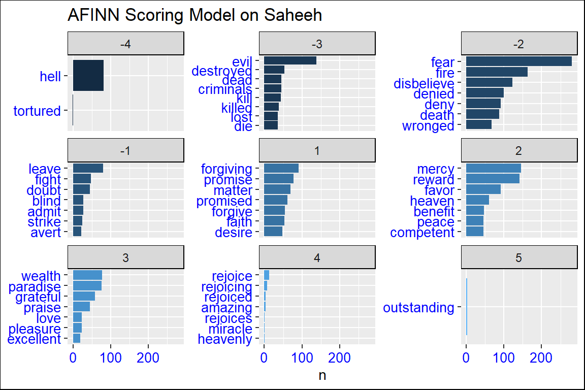
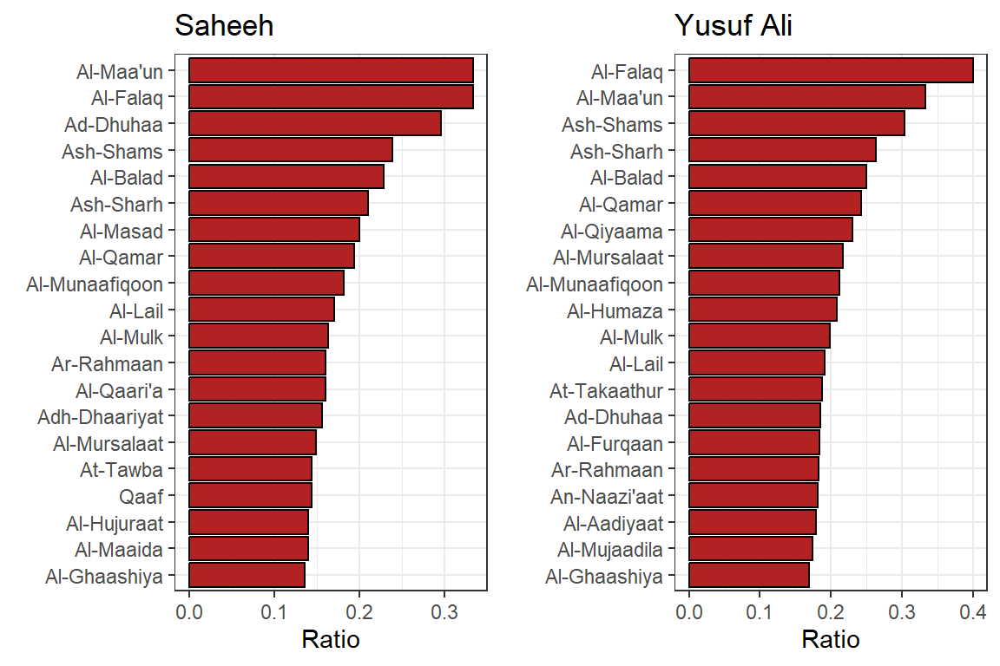
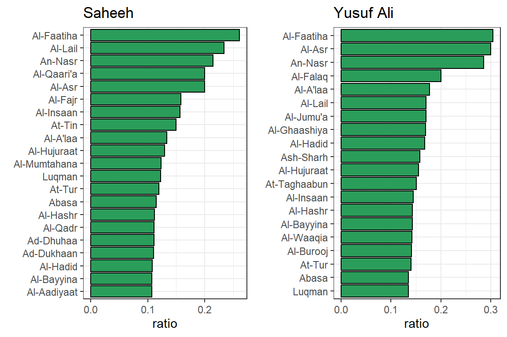
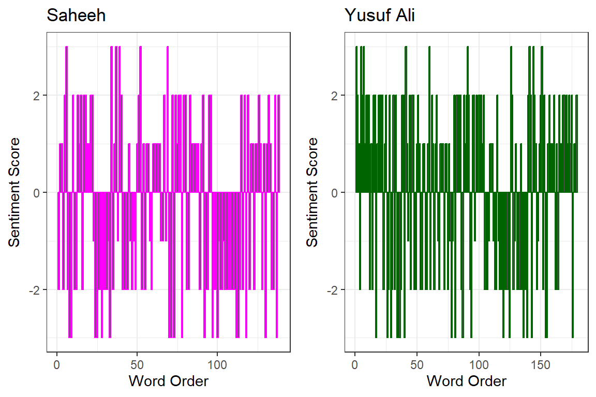
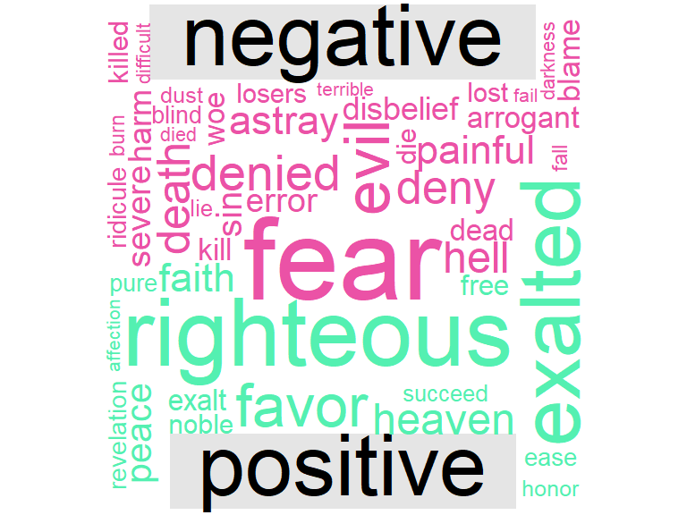
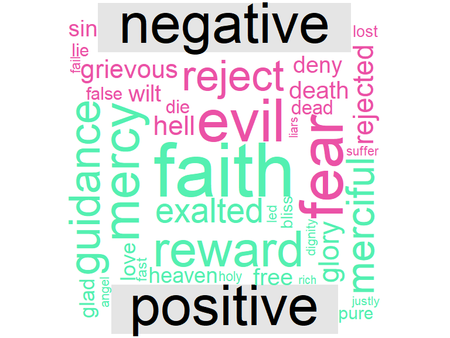
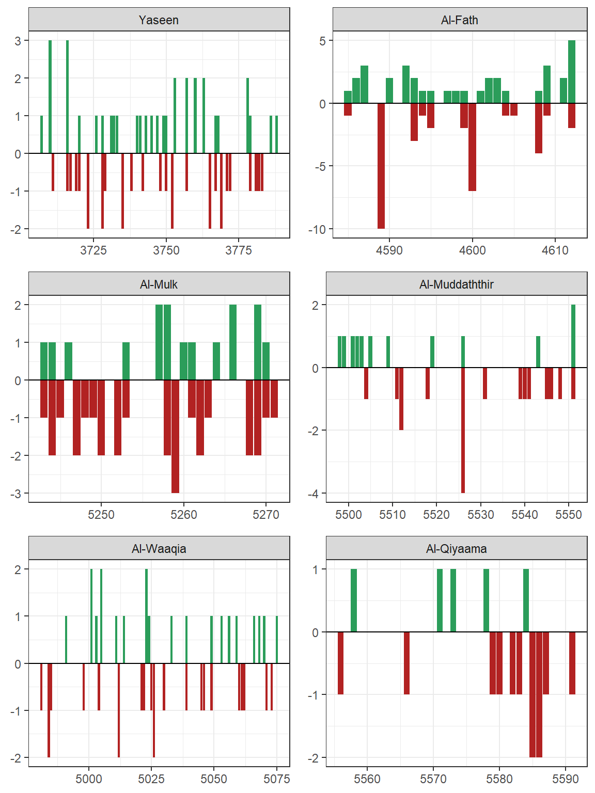

# Word Scoring Analysis {#word-scoring-analysis}

> "Indeed, We have sent you, [O Muhammad], with the truth as a bringer of good tidings and a warner, and you will not be asked about the companions of Hellfire." [Al-Quran Saheeh 2:119]

> "And We have not sent you except as a giver of glad tidings and a warner to all Mankind, but most of mankind know not." [ Al-Quran Saheeh 34:28]

Once we have organized the texts into words (i.e., tokenize), we are ready to perform further analysis dealing with the words as data, in scoring these words following a scoring model. The selected scoring model will depend on the objective of the analysis and the structure of the model used. One such method is called _sentiment analysis_. 

In this chapter, we will explore sentiment analysis on the Saheeh and Yusuf Ali English translations of Al-Quran. We will not do any analysis on the Malay version because we could not find any reliable sentiment model developed for the Malay language. Sentiment analysis is done using existing _sentiment scoring models_ or _sentiment lexicons_ for the English language. The choice of which scoring models to choose depends on the objective of the analysis. Since we are using these pre-built models, we do not assume any accuracy of the analysis. However, as an explanatory exercise, we will use them to demonstrate the comparison between the two English translations of Al-Quran (Saheeh and Yusuf Ali) and a general indication of usages of scoring models in NLP, of which sentiment analysis is a special case.

One fundamental theme of Al-Quran is "Basheeran" and "Nazeeran", bringing "glad tidings" and "warnings" to all mankind, as denoted by verse 2:119 and verse 34:28, quoted above.^[Verses with "Basheeran" (glad tidings) appears 18 times, and "Nazeeran" (warnings) appears 58 times. By the number of counts of words, the emphasis of "warning" is greater than "glad tidings".] From a sentiment analysis perspective, "glad tidings" is equated with "positive sentiments" and "warnings" is equated with "negative sentiments". In this chapter, we will explore sentiment analysis to view how these sentiments are reflected in the English translations of Al-Quran.

We will explore a few types of sentiment scoring models and a few methods of application to enable us to understand how sentiment analysis work. Any model will have its own assumptions; hence results may differ based on using different models. One of the reasons why this is the case depends on how the scoring model was derived. For example, the _bing_ model is based on "-1" and "+1" scores; the _nrc_ model is based on a binary of "yes" and "no"; while the _AFINN_ model is based on scores between -5 to +5. We can build our own sentiment scoring model given enough datasets (or collection of corpora), based on the subject concerned. This subject is beyond the scope of the current work and left for future research.

Since we will use the same dataset that as in Chapter 2, and the _tidytext_ package, readers can assume that the computing environment in Chapter 2 is continued here. 

## Preprocessing the data {#preprocessing-the-data}

All the works in __R__ for this chapter are just a continuation of the previous computing environment. Before we proceed, we decide whether to remove stopwords from the texts or to retain them. The reasons for removing stopwords are explained in Chapter 2, to remove frequently occurring words that carry no further meaning, except for continuation of the sentence. In _tidytext_ the English stopwords are pre-prepared from three lexicons as _stop_words_ variable. We can use them all together, as we have here, or use the _filter()_ functions to only use one set of stop words if that is more appropriate for certain analysis.


\footnotesize

```r
stop_words = tidytext::stop_words
tidyESIC <- tidyESI %>%
  anti_join(stop_words)
ya_stop_words <- rbind(stop_words,
                      c('ye', 'verily', 'will', 'said', 
                        'say', 'us', 'thy', 'thee', 
                        'thou', 'hath', 'doth'))
tidyEYAC <- tidyEYA %>%
  anti_join(ya_stop_words)
```
\normalsize

Now let us compare the words (tokens) before and after the removal of stopwords:

|  Translations |  Total tokens before | Total tokens after | Unique tokens before | Unique tokens after |
|---------------|----------------------|--------------------|----------------------|---------------------|
| Saheeh   | 158,065|43,996| 5,251 | 4,783 |
| Yusuf Ali | 167,859|52,409| 6,365 | 5,862 |

We can see that the words consist of 72.17 percent of stopwords in Saheeh, and 68.78 percent in Yusuf Ali. That is a significant number of words. On the other hand the stopwords tokens removed are only 8.91 percent for Saheeh, and 7.9 percent for Yusuf Ali, which is much lesser in percentage terms.

Since the data has been cleaned from stopwords, we are now ready to analyze them by having a quick look at the top common words which occur, say, more than 150 times. This is shown below for both translations.

\footnotesize

```r
ch3_plotter1 = function(df,title_label) {
      df %>% 
      count(word, sort = TRUE) %>%
      filter(n > 150) %>%
      mutate(word = reorder(word, n)) %>%
      ggplot(aes(x = word, y = n)) +
      geom_col(fill = '#1FA4CC',color = 'black') +
      labs(title = title_label, x = NULL, y = "number") +
      coord_flip() +
      theme(axis.text = element_text( 
            angle = 0, 
            color="blue", 
            size=10))+theme_bw()
}
```
\normalsize


```r
p1 = ch3_plotter1(tidyESIC,"Saheeh")
p2 = ch3_plotter1(tidyEYAC,"Yusuf Ali")
cowplot::plot_grid(p1,p2)
```

<div class="figure" style="text-align: center">

<p class="caption">(\#fig:ch3fig301)Top common words in the translations</p>
</div>


Now we can see from Figure \@ref(fig:ch3fig301) that the term "Allah" is indeed the highest occurring term by a large count, followed by the term "Lord". This is not surprising since both terms are indeed part of one major theme of Al-Quran. An interesting observation is the term "Muhammad" (SAW) does not appear in Yusuf Ali among the top terms but appears in Sahih. However, the term "messenger" appears in both with different rankings. There are other observations in other terms or words; since this is not the focus of the current analysis, we will leave it to the readers to make their own observations. 

## Sentiment analysis with tidy data {#sentiment-analysis-with-tidy-data}

In Chapter 2, we explored the tidy text format and showed it can easily be used to approach questions about word frequency in the English Quran. This allowed us to analyze which words are used most frequently in the Quran and to compare two versions of the English Quran.

Now let us address the topic of opinion mining or sentiment analysis. We can use the tools of text mining to approach the emotional content of text programmatically.

One way to analyze the sentiment of a text is to consider the text as a combination of its individual words and the sentiment content of the whole text as the sum of the sentiment content of the individual words. There are other approaches, but this approach can easily take advantage of the tidy tools.

### Sentiment scoring models

The _tidytext_ package provides access to several sentiment lexicons. Three general-purpose lexicons are

1. AFINN from Finn Årup Nielsen,
2. bing from Bing Liu and collaborators, and
3. nrc from Saif Mohammad and Peter Turney.

All three of these lexicons are based on unigrams, i.e., single words. These lexicons contain many English words and the words are assigned scores for positive/negative sentiment, and also possibly emotions like joy, anger, sadness, and so forth. In this section, we will use the _bing lexicon_. 

The function _get_sentiments()_ allows us to get specific sentiment lexicons. An example is as follows:

\footnotesize

```r
get_sentiments("bing")
```
\normalsize

### _bing_ scoring model

One advantage of having the data.frame with both sentiment and word is that we can analyze word counts that contribute to each sentiment. By implementing _count()_ here with arguments of both word and sentiment, we find out how much each word contributed to each sentiment.

This can be shown visually, and we can pipe straight into _ggplot2_, if we like, because of the way we are consistently using tools built for handling tidy data frames. Now let us plot the main words which have negative and positive sentiments for both translations.


```r
bing_word_counts_ESIC <- tidyESIC %>%
  inner_join(get_sentiments("bing")) %>%
  count(word, sentiment, sort = TRUE) %>%
  ungroup()
bing_word_counts_EYAC <- tidyEYAC %>%
  inner_join(get_sentiments("bing")) %>%
  count(word, sentiment, sort = TRUE) %>%
  ungroup()

ch3_bing_plot = function(sent_df,title_label){
  sent_df %>% 
    group_by(sentiment) %>% 
    top_n(20) %>% ungroup() %>% 
    mutate(word = reorder(word,n)) %>% 
    ggplot(aes(word,n,fill = sentiment)) +
      geom_col(show.legend = FALSE) +
      facet_wrap(~sentiment, scales = "free_y") +
      labs(y = title_label, x = NULL) +
      coord_flip() +
      theme(axis.text = element_text(
                        angle = 0,
                        color = "blue",
                        size = 10),
            strip.text.x = element_text(size = 12,face = 'bold'),
            plot.background = element_rect(color = "black"))
}
p1 = ch3_bing_plot(bing_word_counts_ESIC,"Saheeh")
p2 = ch3_bing_plot(bing_word_counts_EYAC,"Yusuf Ali")

cowplot::plot_grid(p1,p2)
```

<div class="figure" style="text-align: center">

<p class="caption">(\#fig:ch3fig302)Bing's top negative and positive words</p>
</div>


Figure \@ref(fig:ch3fig302) interestingly shows that for both translations, the shape is identical for both negative and positive plots. Again, we can see that the top two words for negative are the same for both translations, "fear" and "evil", but for positive they differ: "merciful" and "righteous" for Saheeh, and "faith" and "mercy" for Yusuf Ali. The scoring for other words differs quite significantly, which implies that the style of writing for the translations is not the same.

This indicates that while translating from the same source, using the _bing_ sentiment model, the sentiments expressed by the words in English as translated, reflect different intonations from a sentiment point of view. Whether this is due to the sentiment model, or the writing is not known, until further investigations. The way to do this is by running the same analysis using a different scoring model. The results show that the scoring is "model-dependent", as we will show next.

### _AFINN_ scoring model

Now let us compare with the _AFINN_ scoring model and observe if there are any major changes to the findings using the _bing_ model.


<div class="figure" style="text-align: center">

<p class="caption">(\#fig:ch3fig303)AFINN scoring model on Saheeh</p>
</div>


<div class="figure" style="text-align: center">

<p class="caption">(\#fig:ch3fig304)AFINN scoring model on Yusuf Ali</p>
</div>


We can see that the dimensions of sentiment are different in the _AFINN_ model as compared to _bing_. Furthermore, the scoring numbers and the terms, as well as the counts for the two translations, show major differences (as observed from Figure \@ref(fig:ch3fig303), the plots for Saheeh compared to Figure \@ref(fig:ch3fig304), the plots Yusuf Ali). Again we want to note that what we have shown is just an exploratory view of the sentiment analysis using various models and what they may imply.

There are many other ready-made sentiment scoring models available. We will leave it to the readers to try on their own.

## Sentiment analysis within the Surahs {#sentiment-analysis-within-the-surahs}

Since Al-Quran is arranged by Surahs or chapters, we would like to investigate if we can use sentiment scoring models to score each of the Surahs and measure which Surahs use the most "negative" words ("warnings") and the most "positive" words ("glad tidings").

We can apply the _bing_ model as follows:


```r
bingnegative <- get_sentiments("bing") %>% 
  filter(sentiment == "negative")

wordcountsESIC <- tidyESIC %>%
  group_by(surah_title_en) %>%
  summarize(words = n())

wordcountsEYAC <- tidyEYAC %>%
  group_by(surah_title_en) %>%
  summarize(words = n())

ch3_bing_plot2 = function(sent_df,title_label){
  sent_df %>%
      semi_join(bingnegative) %>%
      group_by(surah_title_en) %>%
      summarize(negativewords = n()) %>%
      left_join(wordcountsESIC, by = c("surah_title_en")) %>%
      mutate(ratio = negativewords/words) %>%
      top_n(20) %>%
      ggplot(aes(x = reorder(surah_title_en,ratio), y = ratio)) +
        geom_col(fill = 'firebrick',color = 'black') +
        labs(title = title_label, x = NULL,y = "Ratio") +
        coord_flip() +
        theme(axis.text = element_text( 
              angle = 0, 
              color="blue", 
              size=10))+theme_bw()
}

p1 = ch3_bing_plot2(tidyESIC,"Saheeh")
p2 = ch3_bing_plot2(tidyEYAC,"Yusuf Ali")

cowplot::plot_grid(p1,p2)
```

<div class="figure" style="text-align: center">

<p class="caption">(\#fig:ch3fig305)Negative Surahs scoring</p>
</div>


Figure \@ref(fig:ch3fig305) shows the Surahs or chapters with the most "negative" words, normalized for the number of words in the Surah. The Surahs in Saheeh differ from the ones in Yusuf Ali. There are some similarities and differences between the translations, which very likely is dependent on the exact words used in the Surahs and the scores applied.

Let us repeat for "positive" Surahs.


<div class="figure" style="text-align: center">

<p class="caption">(\#fig:ch3fig306)Positive Surahs scoring</p>
</div>


It is interesting to note the similarities and differences between Saheeh and Yusuf Ali for the categorization of Surahs as demonstrated in Figure \@ref(fig:ch3fig306).

Now let us study the sentiment within a Surah, such as Surah Yusuf, which is a middle-length Surah for comparison. The idea here is to observe the sentiment scores as we move along the Surah.


```r
Surah_yusuf_ESIC <- tidyESIC %>%
  inner_join(get_sentiments("afinn")) %>%
  filter(surah_title_en %in% c("Yusuf"))

Surah_yusuf_EYAC <- tidyEYAC %>%
  inner_join(get_sentiments("afinn")) %>%
  filter(surah_title_en %in% c("Yusuf"))
ch3_syplot = function(sy_df,title_label,col_disp){
  sy_df %>% 
        ggplot(aes(x = 1:nrow(sy_df), y = value )) +
          geom_col(show.legend = FALSE, color = col_disp) +
          labs(title = title_label, 
               x = "Word Order",
               y = "Sentiment Score")+theme_bw()
}

p1 = ch3_syplot(Surah_yusuf_ESIC,"Saheeh","magenta")
p2 = ch3_syplot(Surah_yusuf_EYAC,"Yusuf Ali","darkgreen")

cowplot::plot_grid(p1,p2)
```

<div class="figure" style="text-align: center">

<p class="caption">(\#fig:ch3fig307)Sentiment scoring within Surah Yusuf</p>
</div>


Here in Figure \@ref(fig:ch3fig307), we use the _AFFIN_ model for scoring and tracking the scores as we move from one word to the next in Surah Yusuf. As we can see from the plot, the sentiments (as indicated by the scores), change alternatingly like a wave throughout the Surah, from a series of positives to a series of negatives. This is the narrative view of the sentiments within the flow of the texts. This observation deserves some attention since, in most normal texts such as novels, the sentiments are not as alternating as we see here.^[For example, see sentiment narrative in Jane Austen's novels in @silge2017.] If we take the meaning of giving "good tidings" (Basheeran) and "warnings" (Nazeeran) of Al Quran, the alternating scores probably reflect it. The same analysis can be repeated for any Surah by changing the Surah title.

### Wordcloud analysis

Wordcloud is also useful for doing sentiment analysis by deploying _comparison.cloud()_ function. To use this we need to turn the data frame into a matrix with _reshape2_’s _acast()_ function. Many steps can all be done with _joins_, _%>%_ (piping), and _dplyr_ because the data is in _tidy_ format.


```r
library(reshape2) # to use cast function
tidyESIC %>%
  inner_join(get_sentiments("bing")) %>%
  count(word, sentiment, sort = TRUE) %>%
  acast(word ~ sentiment, value.var = "n", fill = 0) %>%
  comparison.cloud(colors = c("#eb52a6", "#54f0b1"),
                   max.words = 200,
                   random.order = FALSE,
                   rot.per = 0.35)
```

<div class="figure" style="text-align: center">

<p class="caption">(\#fig:ch3fig308)Comparison cloud for Saheeh translation</p>
</div>


<div class="figure" style="text-align: center">

<p class="caption">(\#fig:ch3fig309)Comparison cloud for Yusuf Ali translation</p>
</div>


The output for Saheeh is in Figure \@ref(fig:ch3fig308), and for Yusuf Ali is in Figure \@ref(fig:ch3fig309). We can observe clearly the words "fear", "evil", "hell", dominate the negative sentiments; while the words "faith", "righteous", "mercy" dominate the positive sentiments in both Saheeh and Yusuf Ali. The difference between the two sources is probably due to the choice of words used in the translations.

## Statistics of sentiment score {#statistics-of-sentiment-score}

Now we will go deeper into the statistics of sentiment scoring. This exercise will provide two benefits:

a) to understand better how sentiment scores are built upon, and
b) to see how the scores affect the various findings based on the simple visual analysis done in previous sections.

First, let us do a general count of "positive" versus "negative" sentiment words in Saheeh and Yusuf Ali using the _bing_ model.

\footnotesize

```r
ESIC_sent = tidyESIC %>% 
  inner_join(get_sentiments("bing")) %>% 
  count(sentiment=="positive")
EYAC_sent = tidyEYAC %>% 
  inner_join(get_sentiments("bing")) %>% 
  count(sentiment=="positive")
sent_ratio_all = data.frame("si_pos" = ESIC_sent$n, 
                            "ya_pos" = EYAC_sent$n)
```
\normalsize

Let us tabulate the scores of positive words and negative words and its percentages in both Saheeh and Yusuf Ali.

|                |  Saheeh                   | Yusuf Ali |
|----------------|---------------------------|-----------|
| Positive words | 3,632  | 4,479 |
| Negative words | 4,910  | 6,129 |
| Percent positive | 0.43 | 0.42 |
| Percent negative |  0.57 | 0.58 |

A first observation is: "warnings" (negative sentiment) exceeds "glad tidings" (positive sentiment) by about 14 percent consistently in both translations. If we use the ratio of appearance of the word "Basheeran" versus "Nazeeran", which is 0.31 percent, as an indicator of emphasis, then the finding is consistent. This is to say that Al-Quran emphasizes more on the "warnings" than the "glad tidings". A simple casual first observation is that the words used in the two English translations of the Quran are "biased" towards negative sentiments. (Obviously, our readers will say that this casual finding must be verified with the original Quran in Arabic.)

Let us see the cases for specific conditions, for example, to compare between "Meccan" Surahs and "Medinan" Surahs. If we group the verses according to this category, will the positive over negative sentiments ratio remain consistent with the whole corpus? 

\footnotesize

```r
ESIC_sent_meccan = tidyESIC %>% 
  filter(revelation_type=="Meccan") %>% 
  inner_join(get_sentiments("bing")) %>% 
  count(sentiment=="positive")
EYAC_sent_meccan = tidyEYAC %>% 
  inner_join(get_sentiments("bing")) %>% 
  filter(revelation_type=="Meccan") %>% 
  count(sentiment=="positive")
```


```r
ESIC_sent_medinan = tidyESIC %>% 
  filter(revelation_type=="Medinan") %>% 
  inner_join(get_sentiments("bing")) %>% 
  count(sentiment=="positive")
EYAC_sent_medinan = tidyEYAC %>% 
  inner_join(get_sentiments("bing")) %>% 
  filter(revelation_type=="Medinan") %>% 
  count(sentiment=="positive")
```


```r
sent_ratio_rev = data.frame("si_pos_meccan" = ESIC_sent_meccan$n, 
                               "ya_pos_meccan" = EYAC_sent_meccan$n,
                               "si_pos_medinan" = ESIC_sent_medinan$n, 
                               "ya_pos_medinan" = EYAC_sent_medinan$n)
```
\normalsize

Again we tabulate the results below:

|                       |  Saheeh                   | Yusuf Ali |
|-----------------------|---------------------------|-----------|
| Positive words Meccan | 2,173  | 2,625 |
| Negative words Meccan | 2,881  | 3,775 |
| Percent positive Meccan | 0.43 | 0.41 |
| Percent negative Meccan | 0.57 | 0.59 |
|---------------|---------------------------|------------|
| Positive words Medinan | 1,459  | 1,854 |
| Negative words Medinan | 2,029  | 2,354 |
| Percent positive Medinan | 0.42 | 0.44 |
| Percent negative Medinan | 0.58 | 0.56 |

Comparing both results, we can observe that the bias towards negative sentiments remains consistent with the whole corpus for both translations. We can say that based on the _bing_ sentiment model^[All works are repeatable with _AFINN_ model in a similar manner.], the messages of "warnings" and "glad tidings" are consistent across revelation periods.^[A simple t-test confirms that the statistical distribution of both samples is the same, and another t-test for comparison of sub-samples against the main sample also holds.]

On another note, the number of positive words and negative words in Meccan Surahs (and verses) exceeds the Medinan Surahs; the reason of which is probably attributed to Meccan Surahs having more verses compared to Medinan Surahs.

## Sentiment scoring frequencies {#sentiment-scoring-frequencies}

Sentiment scoring originates from the information theory of signaling. Each word in a sequence of the text reflects a signal, which in sentiment scoring is symbolized by a sign, such as "positive" or "negative", or "neutral" (or other levels of signals). Combined series of signals is considered as messages.

Let us look into the entire corpus of Saheeh and the _bing_ sentiment model to visualize the signals.


<div class="figure" style="text-align: center">

<p class="caption">(\#fig:ch3fig310)Sentiment frequency in Saheeh corpus</p>
</div>


Figure \@ref(fig:ch3fig310) clearly shows the "signals" in terms of frequencies from the first verse till the last verse for the entire Saheeh corpus. There are verses of abnormally high negative signal (largest score of minus 15) and abnormally high positive signal (largest score of plus 10). It is unclear what to make out of the observations unless a deeper analysis is done together with the Sciences of Al-Quran.^[We leave this subject as a research question.]

The signaling approach of sentiment analysis is also useful to investigate messages within a selected verse or group of verses, such as a Surah. Let us do this for a few selected Surahs: "Yaseen", "Al-Fath", "Al-Mulk", "Al-Muddaththir", "Al-Waaqia", and "Al-Qiyaama". We will choose Saheeh as our source of texts and _bing_ as our model.


<div class="figure" style="text-align: center">

<p class="caption">(\#fig:ch3fig311)Sentiment frequency in selected Surahs</p>
</div>


We chose the selected Surahs for a few reasons. Firstly, they are the Surahs being recited often in daily prayers, particularly Surah Yaseen (for Malaysians), Al-Mulk (for its known virtues). Secondly, they are Surahs with known "strong" messages, such as Surah "Al-Waaqia" and "Al-Qiyaama". 

From Figure \@ref(fig:ch3fig311), we can see how these different Surahs "signals" are reflected throughout the Surah. "Yaseen" is balanced between positive and negative. "Al-Fath" (victory) is with many positives and few large negatives. "Al-Waaqia" is with intermittent positives and negatives. "Al-Qiyaama" is dominantly negative, in particular towards the end of the Surah.

The comments we made are in a way, generalized trends of these signals without reference to the content of the Surah and interpretations of these Surahs. Again, we leave this as a research question. 

## Building dedicated sentiment scoring model {#building-dedicated-sentiment-scoring-model}

Thus far, we have relied on existing pre-built models of sentiment analysis in the English language. Like any model, it is built based on its own sets of assumptions. The performance of these models in the common usage of the English language is quite good and well documented. The question is, do these models match well to analyze the English translations of Al-Quran? It has been argued that any sentiment model is "domain-driven", whereby the training libraries are sourced from a certain domain, such as from the social media (in the case of Twitter sentiment models), or news articles (for a more formal setting), based on American English medium or British English medium (for localization), and so on. Does a simple assumption of using any of the pre-built models applied to the translations of Al-Quran hold?

The task which is important for Quran Analytics is to build dedicated sentiment scoring models based on the Quranic Arabic language. There are few reasons why this is important:

1. The sentiment scoring model for Al-Quran, whether based on the Arabic language or other languages for its translations, must be a dedicated model or models. Firstly, it must be more biased towards the meanings and intents of the messages of Al-Quran. Then it must be less biased for the language, namely Quranic Arabic, Classical Arabic (for Arabic), and any other language medium, such as the English language.
2. Any sentiment scoring model has to rely on Ulum Al-Quran methodologies, and in particular exegesis methodologies, which have been extensively laid out by the Islamic scholars of the past.
3. Furthermore, the dimensions of the "sentiments" should be much larger than a simple binary ("positive" versus "negative") space, and very likely a more complex dimension is necessary.
4. The learning base model, which consists of the corpora, the algorithms of machine learning, inferencing, and the various statistical tools and assumptions must be tested and verified through a rigorous process before deployment in a public setting.

We include the discussion here to highlight the issues and provide views of possible directions and implications for future research.

## Summary {#summary-chapter-3}

Sentiment analysis provides a way to understand the attitudes and opinions expressed in texts. In the chapter, we explored how to apply sentiment analysis for two English translations of Al-Quran using tidy data principles. Most of the results are almost similar. What's interesting here is the resounding similarity between the two English translations of the Al Quran, which reflects among other things:

1. The consistencies of methods of translating Al Quran into the English language do not significantly alter the "mood" within the sentences used.
2. Assuming that the two translators might use a different methodology of exegesis and rely on different rules of the English language, yet when a sentiment engine such as _bing_ is being applied, we find consistencies in sentiment analysis. This may point to the fact that the original text itself (Al-Quran Arabic) is "rich" in its lexical and semantical meaning.

In closing this chapter, we suggest for further studies to:

1. The expectedly different methods of translating Al Quran into the English language do not significantly alter the "mood" within the sentences used.
2. Assuming that the two translators might use a different methodology of exegesis and rely on different rules of the English language, yet when a sentiment engine such as _bing_ is being applied, we find consistencies in sentiment analysis. This may point to the fact that the original text itself (Al-Quran Arabic) is "rich" in its lexical and semantical meaning.

In closing this chapter, we suggest for further research to:

1. Complete a comprehensive study by applying a wider analysis using all available translations of Al-Quran in many languages.
2. Apply various other sentiment scoring analysis models, besides _bing_ and _AFINN_, into the analysis.
3. Study the applications of sentiment modeling to the original Quranic texts.

And finally, we also allude to the need of building a Quran Analytics sentiment model which is based on the Sciences of Al-Quran. It must be driven by Quranic Arabic sentiment analysis and extended to languages other than Arabic which have developed their own sentiment models, such as the English language.

## Further readings

Al-Saffar, A., Awang, S., Tao, H., Omar, N., Al-Saiagh, W., and Al-bared, M. _Malay sentiment analysis based on combined classification approaches and senti-lexicon algorithm._ PLOS ONE, 13(4):1–18, 2018. [@alsaffar2018]

Dawson, C. W., Ghallab, A., Mohsen, A., and Ali, Y. _Arabic sentiment analysis: A systematic literature review._ Applied Computational Intelligence and Soft Computing, 2020. [@dawson2020]

Silge, J. and Robinson, D. _Text Mining with R: A Tidy Approach._ O’Reilly Media, Inc., Newton, Massachusetts, 2017. [@silge2017]

_igraph_ package in __R__. [@igraph]

_ggraph_ package in __R__. [@ggraph]

_cleanNLP_ package in __R__. [@cleanNLP]

_coreNLP_ package in __R__. [@coreNLP]

_sentimentr_ package in __R__. [@sentimentr]

