# Word Cooccurences of Surah Taa Haa {#word-coccurrences-of-Surah-Taa-Haa}

In Chapter 5, we discussed the network graph tools in R like _igraph_ and _ggraph_. The focus was on creating the network of word co-occurrences from Surah Yusuf and then showing the many options in plotting and visualizing. In the summary section of the chapter, we mentioned another important aspect of network graphs, their characteristics, and other numerical statistics. We will refer to terms like diameter, paths and distances, connectedness, clustering, centrality, and modularity measures of the overall Quran word network in Chapter 7.

This chapter will serve as a customized tutorial on the characteristics and statistics of network graphs. We will however choose a new Surah to analyze while learning the related functions in __R__.

In the summary section of Chapter 4, we mentioned that the study opens other investigation avenues like looking into other Surahs of the Quran or analyzing different aspects of the Quran structure. So, in this chapter, we will analyze Surah Taa-Haa (Surah 20) which details the story of Prophet Musa (Moses/Mose). We will discuss centrality and other important network graph measures. We will also explore some layouts provided by _tidygraph_ and _ggraph_ that highlight these measures.

## Data preprocessing {#data-preprocessing}

We repeat the same sequence of steps as in Chapter 5 except that we filter to select Surah Taa-Haa from the Saheeh International Quran _data.frame_ (quran_en_sahih %>% filter(surah == 20)).

\footnotesize

```r
# For the first time model download and execute the below line too
# udmodel <- udpipe_download_model(language = "english")
# Load the model
udmodel <- udpipe_load_model(file = 'english-ewt-ud-2.5-191206.udpipe')
```
\normalsize

We start by annotating Surah Taa-Haa.

\footnotesize

```r
# Select the surah
Q01 <-quRan::quran_en_sahih %>% filter(surah == 20)
x <- udpipe_annotate(udmodel, x = Q01$text, doc_id = Q01$ayah_title)
x <- as.data.frame(x)
```
\normalsize

Again we look at how many times nouns, proper nouns, adjectives, verbs, adverbs, and numbers are used in the same verse in Surah Taa-Haa.

\footnotesize

```r
cooccur <- cooccurrence(x = subset(x, upos %in% c("NOUN", "PROPN", "VERB",
                                                  "ADJ", "ADV", "NUM")), 
                     term = "lemma", 
                     group = c("doc_id", "paragraph_id", "sentence_id"))
```
\normalsize

The result can be easily visualized using the _igraph_ and _ggraph_ packages. We chose the top 50 occurrences for the tutorial so the plots do not clutter.


```r
wordnetwork <- head(cooccur, 50)
wordnetwork <- graph_from_data_frame(wordnetwork)
ggraph(wordnetwork, layout = "kk") +
  geom_edge_link(aes(width = cooc, edge_alpha = cooc), 
                 edge_color = "deeppink") +
  geom_node_point(aes(size = igraph::degree(wordnetwork)), 
                  shape = 1, color = "black") +
  geom_node_text(aes(label = name), col = "darkblue", size = 3) +
  labs(title = "Co-occurrences Within Sentence",
       subtitle = "Top 50 Nouns, Names, Adjectives, Verbs, Adverbs")
```

<div class="figure" style="text-align: center">
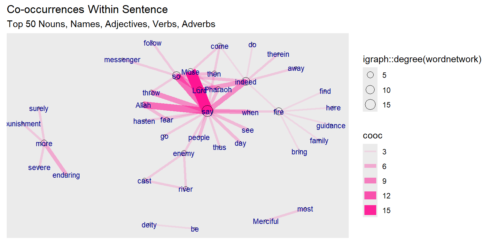
<p class="caption">(\#fig:ch6fig601)First plot of tutorial word network</p>
</div>


The base wordnetwork graph is a directed network with 41 nodes and 50 edges *(DN-- 41 50 -- )*. The nodes have the *name* attribute. The edges have the *cooc* attribute (+ attr: name (v/c), cooc (e/n))

The story is revealed by Allah (SWT). The main characters are Mose, his brother Aaron, Pharaoh, and the magicians. So the verb "say" dominates since it is a narrated story. It is interesting to see the strong link and occurrence of "fear" with "Allah".

## Network analysis and characteristics

This introductory tutorial should be useful for those new to network graphs.^[http://networksciencebook.com] We will be using the network graph tools frequently in our work, thus a tutorial on the network characteristics using an example from the Quran should be helpful.

We will be looking at various functions related to

* [graph_measures: Graph measurements](https://rdrr.io/cran/tidygraph/man/graph_measures.html)
* [centrality: Calculate node and edge centrality](https://rdrr.io/cran/tidygraph/man/centrality.html)
* [group_graph: Group nodes and edges based on community structure](https://rdrr.io/cran/tidygraph/man/group_graph.html)

This set of functions provide wrappers to several graph statistic algorithms in _ìgraph_. They are intended for use inside the _tidygraph_ framework and some should not be called directly. Thus we will mix and match the use of the relevant _igraph_ and/or _tidygraph_ functions.

We will follow the structured presentation on Network Characteristics^[https://dshizuka.github.io/networkanalysis/04_measuring.html] and Centrality Measures^[http://www2.unb.ca/~ddu/6634/Lecture_notes/Lecture_4_centrality_measure.pdf] for easy reference.

### Network characteristics

Our *wordnetwork graph* is a directed network. We will also create an undirected version of the network.

\scriptsize

```r
gd <- wordnetwork
gu <- simplify(as.undirected(wordnetwork))
V(gd)[1:7]
E(gd)[1:4]
E(gd)[5:8]
V(gu)[1:7]
E(gu)[1:4]
E(gu)[5:8]
```
\normalsize

The _igraph_ notation for directed edges uses -> (Mose ->say) and -- for undirected edges (Mose --Allah).

We can measure network properties at the level of nodes (centrality measures) or at the level of the network (global measures). If we are interested in the position of nodes within a network, then we are measuring something at the node level. If we want to understand the structure of the network as a whole, we are measuring something at the network level. Network analysis often combines both.

We will use the two networks, *gu* and *gd*, that we created in this section. For the early examples, we will mainly use the _igraph_ package and the basic plot functions. In the later sections, we will show some of the same examples together with new ones using the _tidygraph_ and _ggraph_ packages.

Re-plotting of *gd* graph is in Figure \@ref(fig:ch6fig602).

<div class="figure" style="text-align: center">
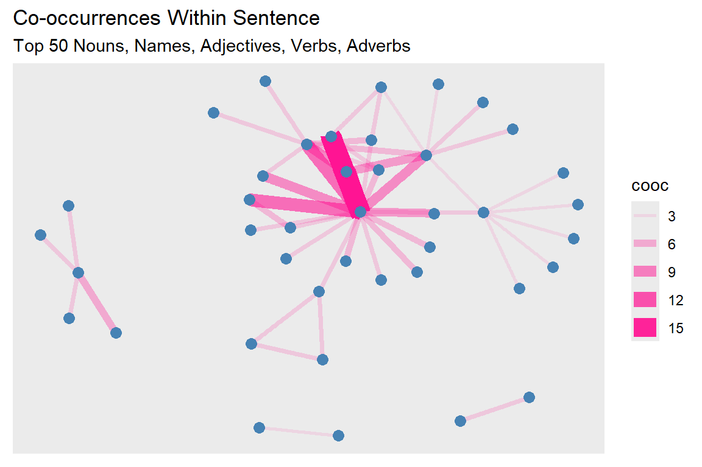
<p class="caption">(\#fig:ch6fig602)Second plot of tutorial word network</p>
</div>

### Centrality measures (node-level measures)

Centrality relates to measures of a node’s position in the network. The main objective is to understand the position and/or importance of a node in the network. The individual characteristics of nodes can be described by^[http://web.stanford.edu/~jacksonm/Jackson-IntroConcepts.pdf]

* Degree
* Clustering
* Distance to other nodes

The *centrality* of a node reflects its influence, power, and importance. There are four different types of centrality measures.

* Degree - connectedness
* Eigenvectors - Influence, Prestige, "not what you know, but whom you know"
* Betweenness - importance as an intermediary, connector
* Closeness, Decay – ease of reaching other nodes

There are many such centrality measures. It can be difficult to go through all of the available centrality measures. We will introduce just a few examples. More examples are shown in our earlier work.^[https://rpubs.com/azmanH/708667]

* Degree centrality
* Betweenness centrality
* Closeness centrality
* Eigenvector centrality
* PageRank centrality

Figure \@ref(fig:ch6fig603) summarizes some of the centrality measures in a graphical format.

<div class="figure" style="text-align: center">
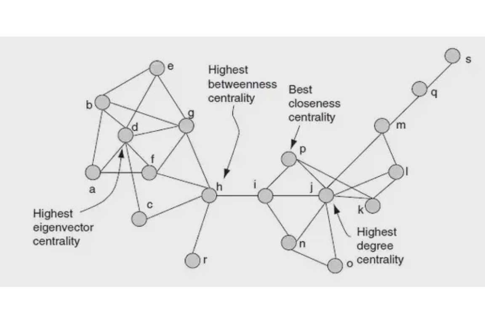
<p class="caption">(\#fig:ch6fig603)Centrality summary</p>
</div>


### Degree and strength

The most straightforward centrality measure is degree centrality. Degree centrality is simply the number of edges connected to a given node. In a social network, this might mean the number of friends an individual has. We will calculate and visualize the degree centrality by varying the node sizes proportional to degree centrality.

This is shown in Figure \@ref(fig:ch6fig604).


```r
degree(gd)[1:5]
degree(gd)[6:10]
set.seed(10)
deg = igraph::degree(gd)
sort(deg, decreasing = TRUE)[1:5]
sort(deg, decreasing = TRUE)[6:10]
ggraph(gd, layout = "kk") +
  geom_edge_link(aes(width = cooc, edge_alpha = cooc), 
                 edge_color = "lightseagreen") +
  geom_node_point(size = deg, color = "gold3")
```

<div class="figure" style="text-align: center">
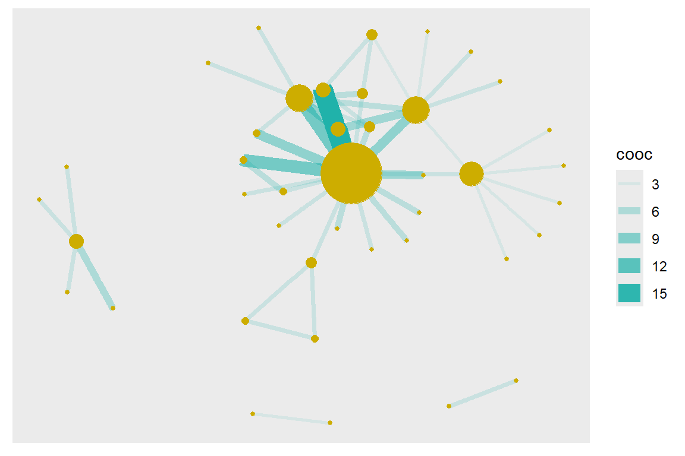
<p class="caption">(\#fig:ch6fig604)Node size reflects degree</p>
</div>


In weighted networks, we can also use node strength, which is the sum of the weight of edges connected to the node. Let us calculate node strength and plot the node sizes as proportional to these values.

This is shown in Figure \@ref(fig:ch6fig605).


```r
set.seed(10)
st = graph.strength(gd)
sort(st, decreasing = TRUE)[1:5]
sort(st, decreasing = TRUE)[6:10]
ggraph(gd, layout = "kk") +
  geom_edge_link(aes(width = cooc, edge_alpha = cooc), 
                 edge_color = "lightseagreen") +
  geom_node_point(size = st, color = "gold3") +
  geom_node_text(aes(filter=(st >= 3), size=st*2, label=name), repel=F)
```

<div class="figure" style="text-align: center">
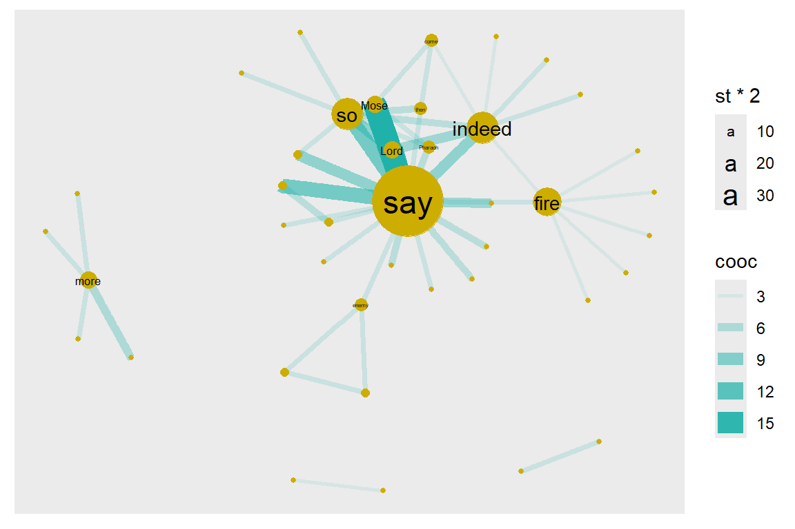
<p class="caption">(\#fig:ch6fig605)Node size reflects graph.strength</p>
</div>


Compare the relative node sizes when plotting by *degree* vs. *strength*. What differences do you notice? The top six words are the same say (18), indeed (8), so (8), fire (7), Mose (4), Lord (4).

### Degree distribution

Degree distribution: A frequency count of the occurrence of each degree.

Let N be the number of nodes, and L be the number of edges. Average degree = 2L/N = 2(50)/41 = 2.439 for gu. The histogram of the degree is shown in Figure \@ref(fig:ch6fig606).


```r
sort(degree(gu), decreasing = TRUE)[1:5]
sort(degree(gu), decreasing = TRUE)[6:10]
mean(degree(gu))
degree(gu) %>% sum()
degree.distribution(gu)[1:5]
degree.distribution(gu)[6:10]
hist(degree.distribution(gu))
```

<div class="figure" style="text-align: center">
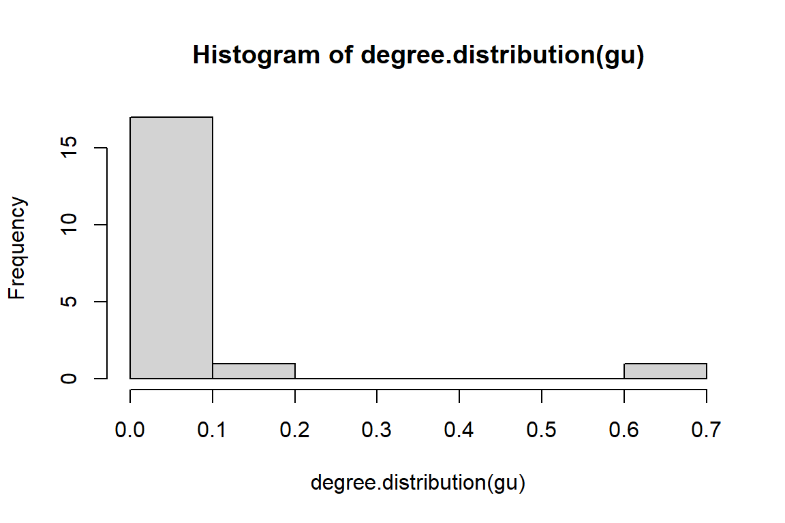
<p class="caption">(\#fig:ch6fig606)Degree distribution of tutorial word network</p>
</div>

### Degree and degree distribution for directed graph

* In-degree of any node i: the number of nodes ending at i.
* Out-degree of any node i: the number of nodes originating from i.
* Every loop adds one degree to each of the in-degree and out-degree of a node.
* Degree distribution: A frequency count of the occurrence of each degree
* Average degree: let N = number of nodes, and L = number of edges:
    * Avg. degree-in = Avg. degree-out = L/N = 50/41 = 1.219, for *gd*.
    
The plots of the histogram are in Figure \@ref(fig:ch6fig607) and Figure \@ref(fig:ch6fig608).


```r
degree(gd,mode="in",loops = FALSE)[1:5]
degree(gd,mode="out",loops = FALSE)[1:5]
degree(gd,mode="in",loops = FALSE) %>% mean()
degree(gd,mode="out",loops = FALSE) %>% mean()
hist(degree.distribution(gd, mode="in"))
```

<div class="figure" style="text-align: center">
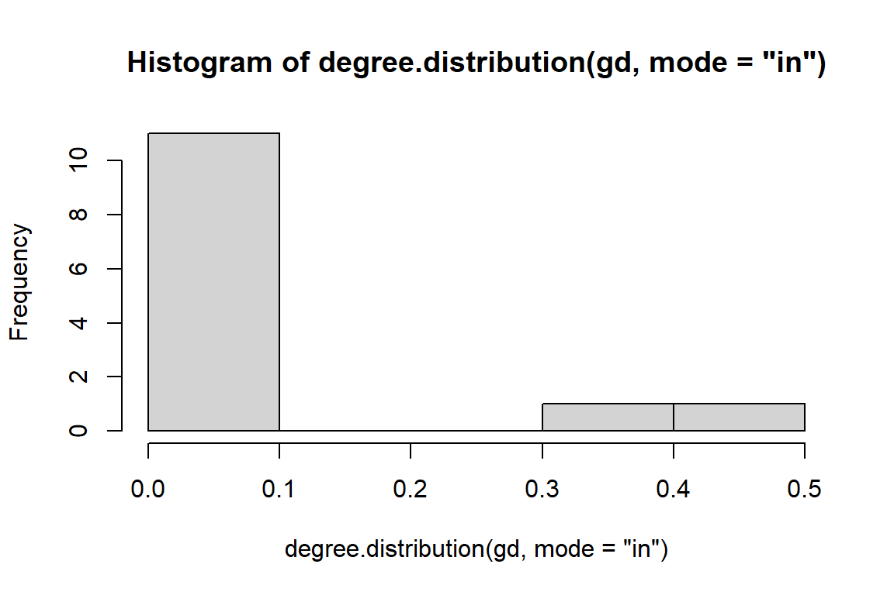
<p class="caption">(\#fig:ch6fig607)In degree distribution of directed word network</p>
</div>


<div class="figure" style="text-align: center">
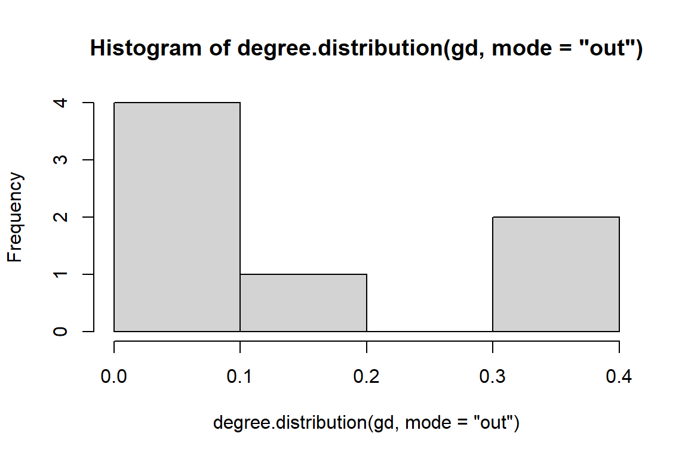
<p class="caption">(\#fig:ch6fig608)Out degree distribution of directed word network</p>
</div>


### Why do we care about degree?

* Simplest, yet very illuminating centrality measure in a network:
    * In a social network, the ones who have connections to many others might have more influence, more access to information, or more prestige than those who have fewer connections.
* The degree is the immediate risk of a node for catching whatever is flowing through the network (such as a virus, or some information)

### Betweenness

We now do the same for betweenness centrality. It is defined as the number of geodesic paths (shortest paths) that go through a given node. Nodes with high betweenness might be influential in a network if, for example, they capture the most amount of information flowing through the network because the information tends to flow through them.

* Betweenness centrality quantifies the number of times a node acts as a bridge along the shortest path between two other nodes.
* It was introduced as a measure for quantifying the control of a human on the communication between other humans in a social network.
* In this conception, nodes that have a high probability to occur on a randomly chosen shortest path between two randomly chosen nodes have a high betweenness.

This is shown in Figure \@ref(fig:ch6fig609).


```r
betw = betweenness(gd, normalized=F)
# calculate the betweenness centrality
sort(betweenness(gu), decreasing = TRUE)[1:5]
# calculate the standardized betweenness centrality
betwS <- 2*betweenness(gu)/((vcount(gu) - 1)*(vcount(gu)-2))
sort(betwS, decreasing = TRUE)[1:5]

ggraph(gd, layout = "kk") +
  geom_edge_link(aes(width = cooc, edge_alpha = cooc), 
     edge_color = "lightseagreen") +
  geom_node_point(size = betw*0.2, color = "gold3") +
  geom_node_text(aes(filter=(betw >= 5), size=betw*2, label=name), repel=F)
```

<div class="figure" style="text-align: center">
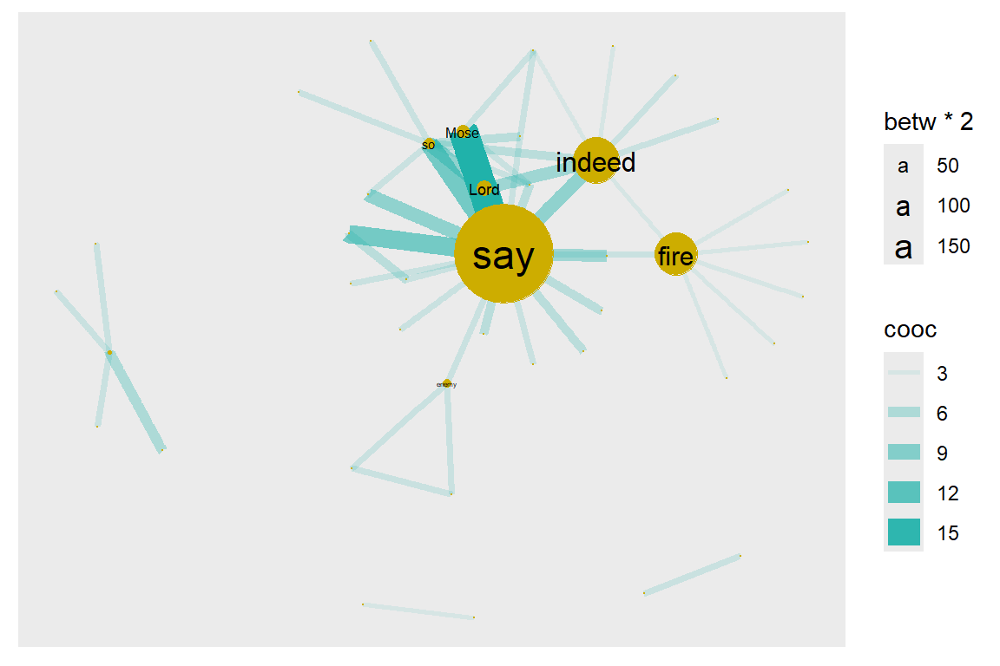
<p class="caption">(\#fig:ch6fig609)Node size reflects betweenness centrality</p>
</div>


We can see that there are three nodes (words = "say", "indeed", "fire") that have qualitatively higher betweenness values than all other nodes in the network. One way to interpret this is that these are nodes that tend to act as “bridges” between different clusters of nodes in the network.

### Degree centrality for undirected graph

* The nodes with a higher degree are more central.
* Degree is simply the number of nodes at distance one.
* Though simple, the degree is often a highly effective measure of the influence or importance of a node.
* In many social settings, people with more connections tend to have more power and are more visible.
* Group-level centralization: degree, as an individual-level centrality measure, has a distribution that can be summarized by its mean and variance as is commonly practiced in data analysis.

\footnotesize

```r
# calculate the degree centrality for business network
deg <- degree(gu, loops = FALSE)
sort(deg, decreasing = TRUE)[1:7]
# calculate the standardized degree centrality
degS <- degree(gu, loops = FALSE)/(vcount(gu) - 1)
sort(degS, decreasing = TRUE)[1:7]
```
\normalsize

### Outdegree centrality and indegree prestige

* The nodes with higher out-degree are more central (choices made).
* The nodes with higher in-degree are more prestigious (choices received).

\footnotesize

```r
sort(degree(gd, mode='in'), decreasing = TRUE) %>% head(10)
sort(degree(gd, mode='out'), decreasing = TRUE) %>% head(10)
```
\normalsize

What does this say about the importance of these nodes? Well, that depends on the network and the questions; in particular how we might quantify ‘importance’ in our network. But clearly "say", "indeed" "Mose", "Allah", "Lord", "Pharaoh" are important words in the Surah. We have explained the importance of "say" in that the Surah is telling a story. "indeed" shows that the Quran is stressing the truth of the narrations.

Here is a shortlist of some commonly-used centrality measures:

* degree() - Number of edges connected to node
* graph.strength() - Sum of edge weights connected to a node (aka weighted degree)
* betweenness() - Number of geodesic paths that go through a given node
*	closeness() - Number of steps required to access every other node from a given node
* eigen_centrality() - Values of the first eigenvector of the graph adjacency matrix. The values are high for nodes that are connected to many other nodes that are, in turn, connected to many others, etc.

### Closeness centrality for undirected graph

* The farness/peripherality of a node _v_ is defined as the sum of its distances to all other nodes
* The closeness is defined as the inverse of the farness.
* For comparison purpose, we can standardize the closeness by dividing by the maximum possible value _1/(n - 1)_
* If there is no (directed) path between node _v_ and _i_ then the total number of nodes is used in the formula instead of the path length.
* The more central a node is, the lower its total distance to all other nodes.
* Closeness can be regarded as a measure of how long it will take to spread information from _v_ to all other nodes sequentially.

\footnotesize

```r
sort(closeness(gu), decreasing = TRUE) %>% head(6)
# calculate the standardized closeness centrality
closeS <- closeness(gu)*(vcount(gu) - 1)
sort(closeS, decreasing = TRUE) %>% head(6)
```
\normalsize

From the various plots in the earlier sections, there are some words outside the main network cluster. They are *disconnected* from the main network. Hence, there are some warning messages for disconnected graphs.

We will calculate the Eigenvector and PageRank centrality measures in the next section as we assemble a _data.frame_ of node-level measures.

### Correlation analysis among centrality measures for the *gu* network

\footnotesize

```r
# calculate the degree centrality
deg <- degree(gu, loops = FALSE)
sort(deg, decreasing = TRUE) %>% head(6) # sort the nodes in decreasing order
# calculate the standardized degree centrality
degS <- degree(gu, loops = FALSE)/(vcount(gu) - 1)
sort(degS, decreasing = TRUE) %>% head(6) # sort the nodes in decreasing order
# calculate the closeness centrality
close <- closeness(gu)
sort(close, decreasing = TRUE) %>% head(6)
# calculate the standardized closeness centrality
closeS <- closeness(gu)*(vcount(gu) - 1)
sort(closeS, decreasing = TRUE) %>% head(6)
# calculate the Betweenness centrality
betw <- betweenness(gu)
sort(betw, decreasing = TRUE) %>% head(6)
# calculate the standardized Betweenness centrality
betwS <- 2 * betweenness(gu)/((vcount(gu) - 1) * (vcount(gu)-2))
sort(betwS, decreasing = TRUE) %>% head(6)
# calculate the Eigenvector centrality
eigen <- evcent(gu)
sort(eigen[[1]], decreasing = TRUE) %>% head(6)
# calculate the PageRank centrality
page <- page.rank(gu)
sort(page[[1]], decreasing = TRUE) %>% head(6)
```
\normalsize

From the above parameters, we assemble a _data.frame_ and plot a correlation matrix, (Figure \@ref(fig:ch6fig610)).


```r
dfu <- data.frame(degS, closeS, betwS, eigen[[1]], page[[1]])
# Pearson correlation matrix
Pearson_correlation_matrix <- cor(dfu) 
# Spearman correlation matrix
Spearman_correlation_matrix <- cor(dfu, method = "spearman") 
# Kendall correlation matrix
cor(dfu, method = "kendall") 
# Basic Scatterplot Matrix
pairs(~deg + close + betw + eigen[[1]] + page[[1]],
      data=dfu)
```

<div class="figure" style="text-align: center">
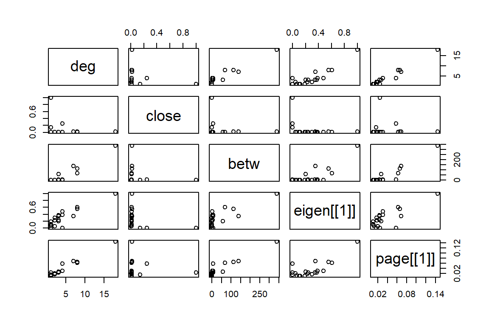
<p class="caption">(\#fig:ch6fig610)Simple Scatterplot Matrix</p>
</div>


### Assembling a dataset of node-level measures for gd network


```r
#assemble dataset
names = V(gd)$name
deg = degree(gd)
st = graph.strength(gd)
betw = betweenness(gd, normalized=F)
eigen <- evcent(gd)
page <- page.rank(gd)
dfd = data.frame(node.name=names, degree=deg, strength=st, 
                 betweenness=betw,
                 eigen = eigen[[1]], page = page[[1]]) 
head(dfd)
# plot the relationship between degree and strength
dfd %>% ggplot(aes(x = strength, y = degree)) + geom_point() +
        geom_text(label = rownames(dfd),
                  size = 3, color = "darkblue",
                  nudge_x = 0.25, nudge_y = 0.25, 
                  check_overlap = T) +
        labs(title = "Word Co-occurrences Network",
             y = "Degree",x = "Strength")
```

<div class="figure" style="text-align: center">
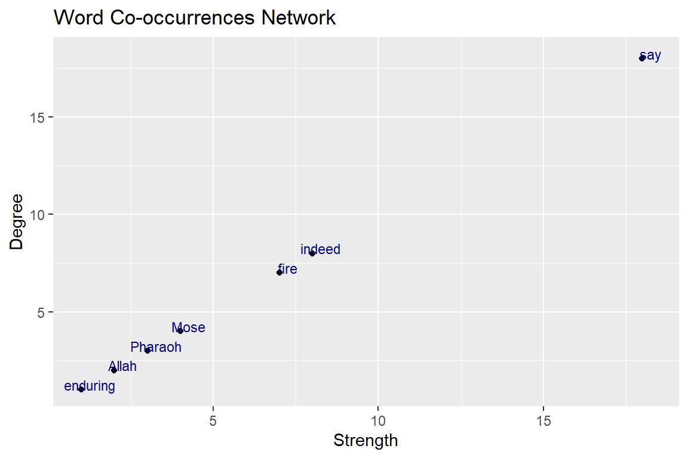
<p class="caption">(\#fig:ch6fig611)Relationship degree and strength</p>
</div>


The straight line in Figure \@ref(fig:ch6fig611) obviously shows that these are correlated since strength is simply the weighted version of degree.

How about the relationship between betweenness and strength?

<div class="figure" style="text-align: center">
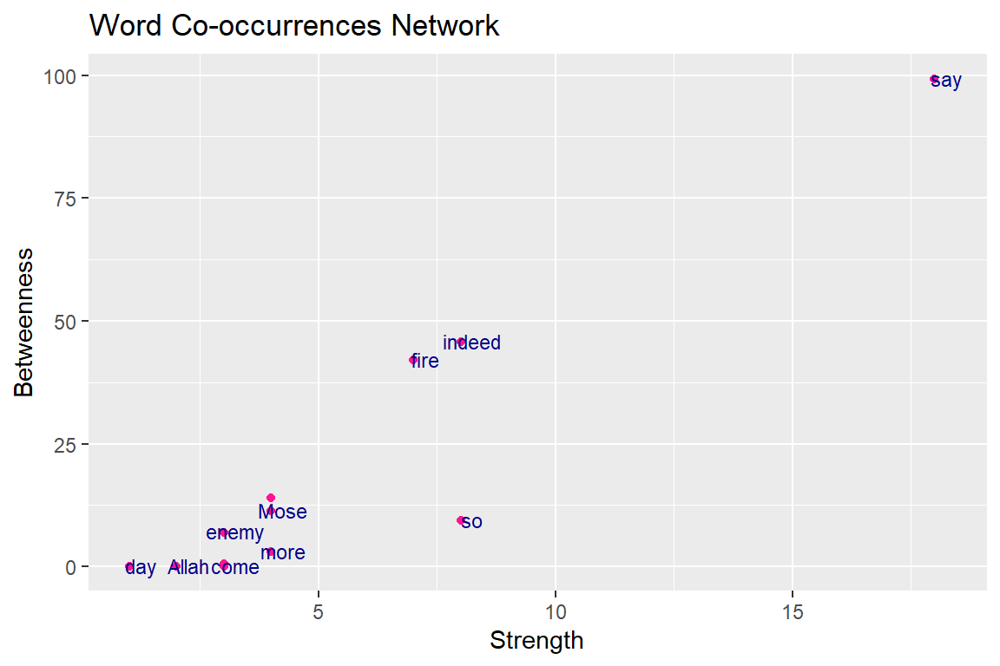
<p class="caption">(\#fig:ch6fig612)Relationship betweenness and strength</p>
</div>


These are not well correlated, since they describe something different (as shown in Figure \@ref(fig:ch6fig612), points are not in a straight line). Again the common words "say" and "indeed" have a dominant role in Surah Taa-Haa that narrates the true story of Prophet Moses. The common adverb "so" is often used for emphasis^[https://www.macmillandictionary.com/dictionary/british/so_1] to stress some facts and lessons of the story.

## Network-level measures {#network-level-measures}

### Size and density
We start by getting some basic information for the network, such as the number of nodes and edges. There are a couple of functions to help us extract this information without having to look it up in the “object summary” (e.g., summary(gd)). Using these functions, we can store the information as separate objects, e.g., _n_ for number of nodes and _m_ for number of edges.

\footnotesize

\normalsize

For *gd* the number of nodes _n_ is 41 and the number of edges _m_ is 50.
For *gu* the number of nodes _n_ is 41 and the number of edges _m_ is 50.

The definition of network density is:

  > density = [# edges that exist] / [# edges that are possible]

In an undirected network with no loops, the number of edges that are possible is exactly the number of dyads that exist in the network. In turn, the number of dyads is _n(n-1)/2_ where _n_ = number of nodes. With this information, we can calculate the density with the following:

  > dyads directed = _n(n-1)_ = 41(41-1) = 1640
  
  > dyads undirected = _n(n-1)/2_ = 41(41-1)/2 = 820

  > density = _m_/dyads

There is a pre-packaged function for calculating density, edge_density():

\footnotesize

\normalsize

### Components

For ‘fully connected’ networks, we can follow edges from any given node to all other nodes in the network. Networks can also be composed of multiple components that are not connected to each other, as is obvious from the plots of our sample word network *gd*. We can get this information with a simple function.


```r
components(gd)$membership[1:7]
components(gd)$csize
components(gd)$no
plot(gd)
```

<div class="figure" style="text-align: center">
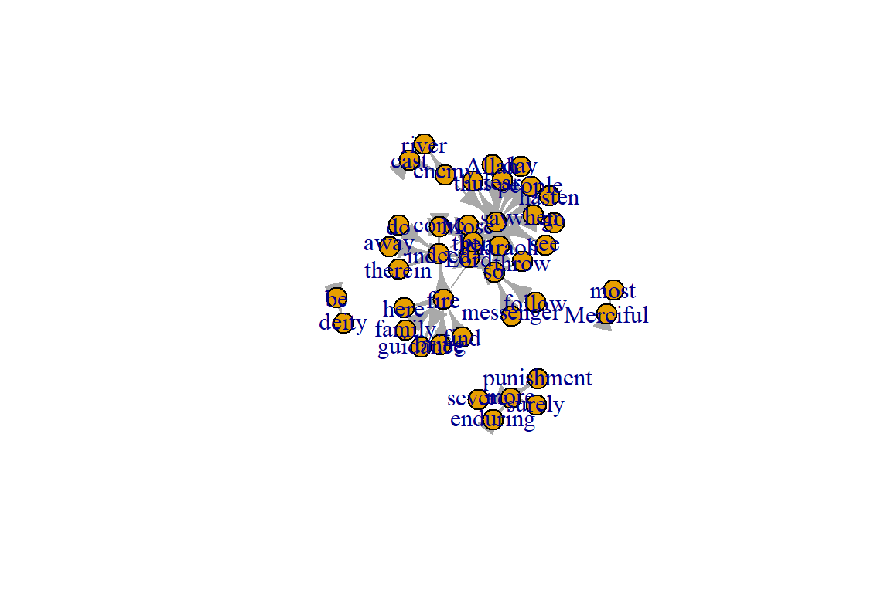
<p class="caption">(\#fig:ch6fig613)Simple plot showing network components</p>
</div>


The output shows the node membership, component sizes, and number of components. The numbers for _no_ (number of components, 4) and _csize_ (size for each component) can be confirmed from Figure \@ref(fig:ch6fig613).

### Degree distributions

Degree distribution, the statistical distribution of node degrees in a network, is a common and often powerful way to describe a network. We can simply look at the degree distribution as a histogram of degrees. (See the plots in Figure \@ref(fig:ch6fig614) and Figure \@ref(fig:ch6fig615)).

<div class="figure" style="text-align: center">
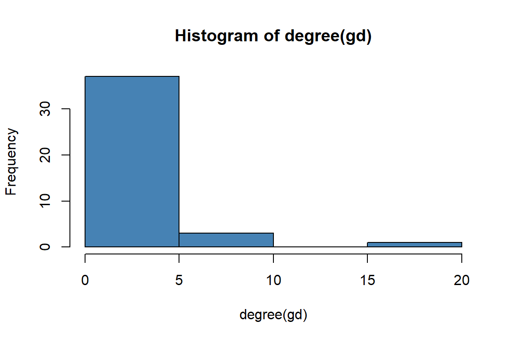
<p class="caption">(\#fig:ch6fig614)Histogram of gd degrees</p>
</div>


<div class="figure" style="text-align: center">

<p class="caption">(\#fig:ch6fig615)Histogram of gu degrees</p>
</div>


However, if we want to compare the degree distributions of different networks, it might be more useful to plot the probability densities of each degree: i.e., what proportion of nodes has degree = 1, degree = 2, etc. We can do this by using the function _degree.distribution()_. The output of the plot is in Figure \@ref(fig:ch6fig616) and Figure \@ref(fig:ch6fig617).

<div class="figure" style="text-align: center">

<p class="caption">(\#fig:ch6fig616)Degree distribution of gd</p>
</div>


<div class="figure" style="text-align: center">
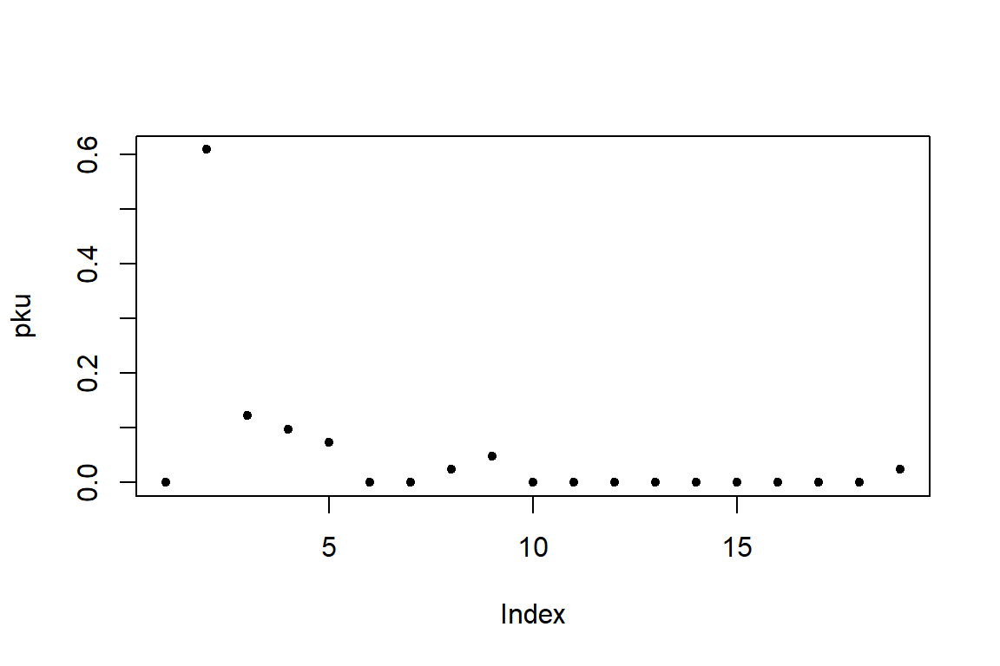
<p class="caption">(\#fig:ch6fig617)Degree distribution of gu</p>
</div>


Degree and degree	distribution play an important role in understanding networks. A higher density changes the component structure of a network and impacts the diffusion and	learning properties. The degree also is an individual node’s	characteristic and reflects	its	position.

### Average path length and diameter

The network “path” is typically a short form for “geodesic path” or “shortest path” — the fewest number of edges to get from one node to another.

* The average path length can be considered as the average “degrees of separation” between all pairs of nodes in the network.
* The diameter (maximum path length) is the maximum degree of separation that exists in the network.

We can calculate path lengths with or without the edge weights (if using edge weights, we simply count up the weights as we go along the path). The _igraph_ package includes a convenient function for finding the shortest paths between every dyad in a network. Make sure algorithm is set as “unweighted”.

* pathd = distances(gd, algorithm="unweighted")
* pathu = distances(gu, algorithm="unweighted")

This matrix is usually large, so we will not display the output. It gives us the geodesic path length between each pair of nodes in the network. We can describe the network using some characteristics of the paths that exist in that network. This matrix contains a bunch of cells that are “Inf” (i.e., infinity). This is because the network is not connected, and we cannot calculate path lengths between nodes in different components.

How should we measure the average path length and diameter of a network with multiple components? There are two common solutions. The first is to ignore pairs of nodes that are in different components and only measure the average lengths of the paths that exist. This solution does not make sense for the diameter since the diameter of an unconnected network should be infinite. The second solution is to measure each component separately. We will do each of these in turn.

Option 1: To calculate the average path length while ignoring pairs of nodes that are in different components, we can first replace the “Inf” with “NA” in the path length matrix. Next, we want just the “upper triangle” or “lower triangle” of this matrix, which lists all the geodesic paths without duplicates.

\footnotesize

```r
pathd = distances(gd, algorithm="unweighted")
pathu = distances(gu, algorithm="unweighted")
pathd[pathd=="Inf"]=NA
mean(pathd[upper.tri(pathd)], na.rm=T)
pathu[pathu=="Inf"]=NA
mean(pathu[upper.tri(pathu)], na.rm=T)
```
\normalsize

This is what the function mean_distances() does for unconnected networks because we will get the same value:

\footnotesize

```r
mean_distance(gd)
mean_distance(gu)
```
\normalsize

Option 2: To calculate the average path lengths and diameter separately for each component, we will first ‘decompose’ the network into a list that contains each component as separate graph objects. We can then use the lapply() function to calculate separate path length matrices, and sapply() function to calculate the mean and max for each matrix.

\footnotesize

```r
comps = decompose(gd)
#make list object with two path length matrices
path.list = lapply(comps, function(x) distances(x, algorithm="unweighted")) 
#average path length of each component
avg.paths=sapply(path.list, mean) 
#diameter of each component
diams=sapply(path.list, max) 
avg.paths
diams
```
\normalsize

### Path distance distribution

Path distribution: A frequency count of the occurrence of each path distance.

\footnotesize

```r
average.path.length(gu)
path.length.hist(gu)
```
\normalsize

* $res is the histogram of distances,
* $unconnected is the number of pairs for which the first node is not reachable from the second.

### Path distance distribution for directed graph

\footnotesize

```r
average.path.length(gd)
path.length.hist (gd)
```
\normalsize

### Why do we care about path?

* Path means connectivity.
* Path captures the indirect interactions in a network, and individual nodes benefit (or suffer) from indirect relationships because friends might provide access to favors from their friends or a virus might spread through the links of a network.

* Path is closely related to the small-world phenomenon.
* Path is related to many other centrality measures.

### Clustering coefficient (Transitivity) distribution

There are two formal definitions of the Clustering Coefficient (or Transitivity): “global clustering coefficient” and “local clustering coefficient”. They are slightly different, but both deal with the probability of two nodes that are connected to a common node being connected themselves (e.g., the probability of two of your friends knowing each other).

* Global Clustering Coefficient = “ratio of triangles to connected triples”
* Local Clustering Coefficient = for each node, the proportion of their neighbors that are connected to each other
* Average Local Clustering Coefficient: If _Ci_ is the proportion of two nodes connected to node _i_ that are also connected to each other (i.e., the Local Clustering Coefficient), then Average Local Clustering Coefficient = _sum(Ci)/n_

\footnotesize

```r
# global clustering: the ratio of the triangles and 
# the connected triples in the graph
g.cluster = transitivity(gd, "global")
# local clustering
l.cluster = transitivity(gd, "local") 
# average clustering
av.l.cluster = transitivity(gd, "localaverage") 
g.cluster
l.cluster[1:6]
av.l.cluster
# undirected
g.cluster = transitivity(gu, "global")
l.cluster = transitivity(gu, "local")
av.l.cluster = transitivity(gu, "localaverage")
g.cluster
l.cluster[1:6]
av.l.cluster
```
\normalsize

### Why do we care about clustering coefficient?

* A clustering coefficient is a measure of the degree to which nodes in a graph tend to cluster together. In most real-world networks, and in particular social networks, nodes tend to create tightly knit groups characterized by a relatively high density of links; this likelihood tends to be greater than the average probability of a link randomly established between two nodes.
* Nodes with higher degrees have a lower local clustering coefficient on average.
* Local clustering can be used as a probe for the existence of so-called structural holes in a network, which are missing links between neighbors of a node.
* Structural holes can be bad when we are interested in the efficient spread of information or other traffic around a network because they reduce the number of alternative routes information can take through the network.
* Structural holes can be a good thing for the central node whose friends lack connections because they give power over information flow between those friends.
* The local clustering coefficient measures how influential a node is in this sense, taking lower values the more structural holes there are in the network around it.
* Local clustering can be regarded as a type of centrality measure, albeit one that takes small values for powerful individuals rather than large ones.

## Community structure and assortment {#community-structure-and-assortment}

Networks exhibit community structure, the presence of discrete clusters of nodes that are densely connected, which themselves are only loosely connected to other clusters. These may be clusters of individuals that form social groups. How do we detect the presence of such clusters or communities, and how can we quantify the degree of community structure?

### Modularity and community detection

Modularity-based methods of community detection are not fool-proof. There is no perfect approach to community detection. There are several functions available for community detection in _igraph_ and other packages.

* edge.betweenness.community()
    * One of the first in the class of “modularity optimization” algorithms. It is a “divisive” method. Cut the edge with the highest edge betweenness, and recalculate. Eventually, you end up cutting the network into different groups.
* fastgreedy.community()
    * Hierarchical agglomerative method that is designed to run well in large networks. Creates “multigraphs” where you lump groups of nodes together in the process of agglomeration to save time on sparse graphs.
* walktrap.community()
    * Uses random walks to calculate distances, and then use agglomerative method to optimize modularity
* spinglass.community()
    * This method uses the analogy of the lowest-energy state of a collection of magnets (a so-called spin-glass model).
* leading.eigenvector.community()
    * This is a “spectral partitioning” method. You first define a ‘modularity matrix’, which sums to 0 when there is no community structure. The leading eigenvector of this matrix ends up being useful as a community membership vector.
* cluster_louvain()
    * The “Louvain” method, so-called because it was created by a group of researchers at Louvain University in Belgium.

### Modularity and community detection: a simple example

Our undirected word co-occurrence network *gu* appears to have a clear community structure from the earlier plots (see Figure \@ref(fig:ch6fig618)).


<div class="figure" style="text-align: center">
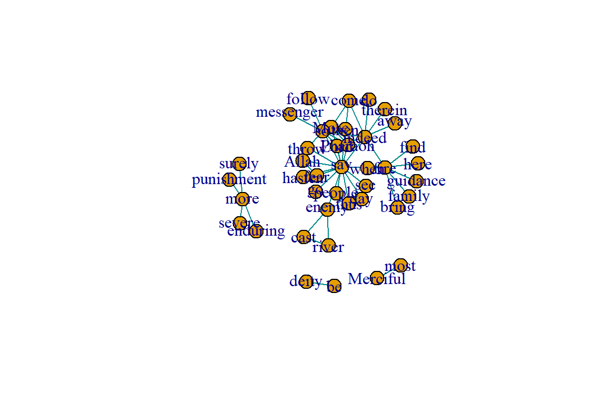
<p class="caption">(\#fig:ch6fig618)Layout plot of gu</p>
</div>


Because the community division in this example is clear, we can choose any of the community detection methods as described in the previous section and we are likely to come up with the same answer.

\footnotesize

```r
eb = edge.betweenness.community(gu) 
length(eb) # number of communities
modularity(eb) # modularity
```
\normalsize

The resulting object is a 'communities object', which includes a few pieces of information - the number of communities (groups), the modularity value based on the node assignments, and the membership of nodes to each community. We can call each of these values separately.

We can also use this 'communities object' to show the community structure (see Figure \@ref(fig:ch6fig619)).

<div class="figure" style="text-align: center">
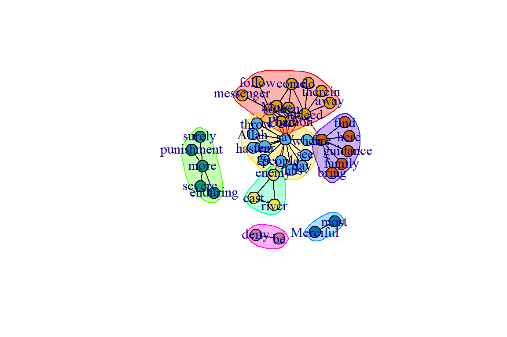
<p class="caption">(\#fig:ch6fig619)Community structure using edge.betweenness.community()</p>
</div>


We repeat with the Louvain method (see Figure \@ref(fig:ch6fig620)):

<div class="figure" style="text-align: center">
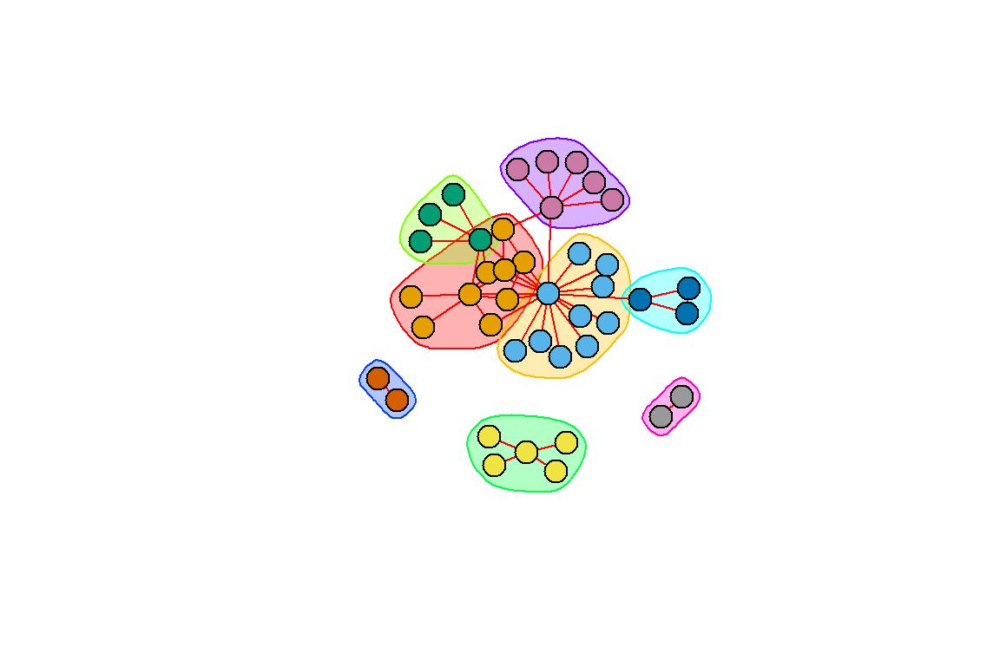
<p class="caption">(\#fig:ch6fig620)Community structure using the Louvain method</p>
</div>


Figures \@ref(fig:ch6fig619) and \@ref(fig:ch6fig620) show that the two different methods yield different results; one with 7 and the other 8 communities (groups).

We can customize the plot. We use the *RColorBrewer* package to assign colors (see Figure \@ref(fig:ch6fig621)).

<div class="figure" style="text-align: center">
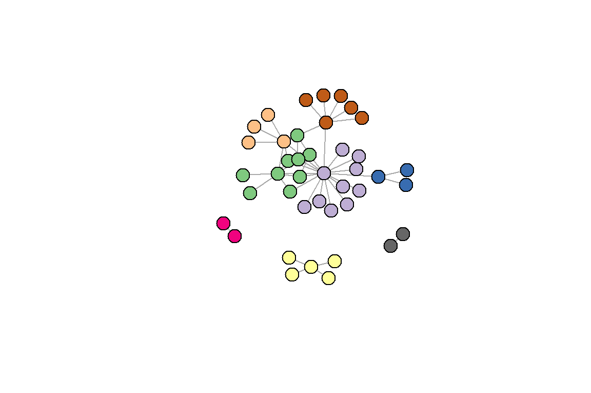
<p class="caption">(\#fig:ch6fig621)Using the Louvain method with some color adjustments</p>
</div>


### Another example of clustering

The goal of clustering (also referred to as “community detection”) is to find cohesive subgroups within a network. We have mentioned earlier that there are various algorithms for graph clustering in _igraph_. It is important to note that there is no real theoretical basis for what constitutes a cluster in a network except for the vague “internally dense” versus “externally sparse” argument. As such, there is no clear argument for or against certain algorithms/methods.

No matter which algorithm is chosen, the workflow is always the same.

\footnotesize

```r
clu <- cluster_louvain(gu)
mem <- membership(clu) # membership vector
head(mem)
com <- communities(clu) # communities as list
com[[1]]
```
\normalsize

An example using selected graph clustering algorithms for our *gu* network is shown below.

\footnotesize


```r
scores <- c(infomap = modularity(gu,membership(imc)),
            eigen = modularity(gu,membership(lec)),
            louvain = modularity(gu,membership(loc)),
            walk = modularity(gu,membership(wtc)))
scores
```
\normalsize

For the *gu* network, the modularity score is around 0.5 despite the different functions. In general, though, it is advisable to use cluster_louvain() since it has the best speed/performance trade-off.

### Assortment (homophily)

One major pattern common to many social networks (and other types of networks) is homophily or assortment — the tendency for nodes that share a trait to be connected. The assortment coefficient is a commonly used measure of homophily. It is similar to the modularity index used in community detection, but the assortativity coefficient is used when we know a priori the ‘type’ or ‘value’ of nodes. For example, we can use the assortment coefficient to examine whether discrete node types (e.g., gender, ethnicity, etc.) are more or less connected to each other. Assortment coefficient can also be used with “scalar attributes” (i.e. continuously varying traits).

__Assortment coefficient__

There are at least two easy ways to calculate the assortment coefficient. In the _igraph_ package, there is a function for assortativity(). One benefit to this function is that it can calculate assortment in directed or undirected networks. However, the major downside is that it cannot handle weighted networks.

__Assortment: a simple example with igraph__

We use the same example network in this tutorial to demonstrate how to calculate assortativity, and to compare the difference between modularity and assortativity.

We start by assigning each node a value and let it vary in size (see Figure \@ref(fig:ch6fig622)).


```r
set.seed(3)
l = layout_with_kk(gu)
# assign sizes to nodes using two normal distributions 
# with different means
V(gu)$size = 2*degree(gu) 
plot(gu, layout=l, edge.color="black", repel=T)
```

<div class="figure" style="text-align: center">
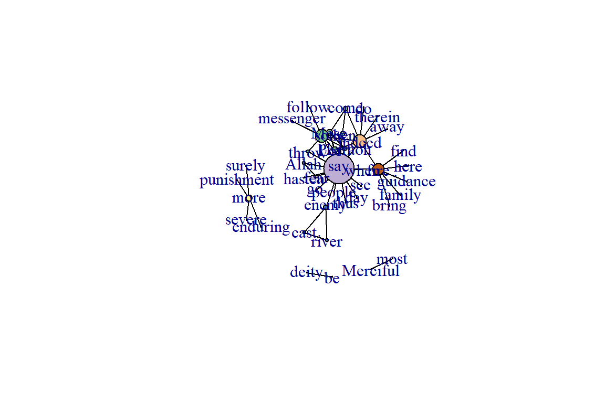
<p class="caption">(\#fig:ch6fig622)Node size reflecting its degree</p>
</div>

```r
assortativity(gu, V(gu)$size, directed=F)
```


This network exhibits negative (low) levels of assortativity by node size.

We can also convert the size variable into a binary (i.e., discrete) trait and calculate the assortment coefficient (see Figure \@ref(fig:ch6fig623)).


```r
V(gu)$size.discrete = (V(gu)$size > 5) + 0
# shortcut to make the values = 1 if large individual 
# and 0 if small individual, with cutoff at size = 5
plot(gu, layout=l, edge.color="black", repel=T)
```

<div class="figure" style="text-align: center">

<p class="caption">(\#fig:ch6fig623)Node size discrete</p>
</div>

```r
assortativity(gu, V(gu)$size.discrete, directed=F)
```


As a comparison, we create a node attribute that varies randomly across all nodes in the network and then measure the assortativity coefficient based on this trait. We will plot the figure with square nodes, just to make it clear that we are plotting a different trait(see Figure \@ref(fig:ch6fig624)).


```r
set.seed(3)
# create a node trait that varies randomly for all nodes 
V(gu)$random = rnorm(41, mean=20, sd=5) 
assortativity(gu, V(gu)$random, directed=F)
plot(gu, layout=l, edge.color="black", vertex.size=V(gu)$random,
     vertex.shape="square")
```

<div class="figure" style="text-align: center">
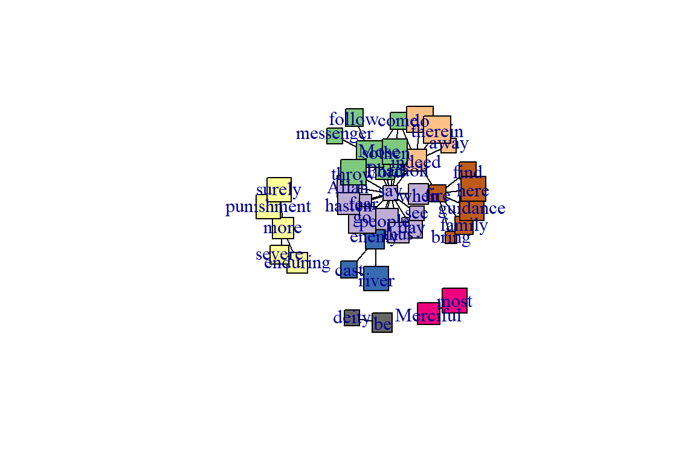
<p class="caption">(\#fig:ch6fig624)Using different node shape</p>
</div>


We can see that there is little assortment based on this trait.

Just to be extra clear, this network still exhibits a community structure, but the trait we are measuring does not exhibit assortativity.

## Analyzing using _tidygraph_ {#analyzing-using-tidygraph}

Earlier we created the *wordnetwork* using _igraph_. In this section, we will show similar and different examples using _tidygraph_.

Two functions of the _tidygraph_ package can be used to create network objects, they are:

* tbl_graph() creates a network object from nodes and edges data.
* as_tbl_graph() converts network data and objects to a tbl_graph network.

A central aspect of _tidygraph_ is to directly manipulate node and edge data from the tbl_graph object by activating nodes or edges. When we first create a tbl_graph object, the nodes will be activated. We can then directly calculate node or edge measures, like centrality, using _tidyverse_ functions.

\footnotesize

```r
library(tidygraph)
gt <- as_tbl_graph(wordnetwork)
gt
```
\normalsize

Notice how the _igraph_ *wordnetwork* is converted into two separate tibbles, Node Data and Edge Data. But both *wordnetwork* and *gt* are of the same _igraph class_.

### Direct ggraph integration

*gt* can directly be used with our preferred _ggraph_ package for visualizing networks (see the plot output in Figure \@ref(fig:ch6fig625)).


```r
ggraph(gt, layout = 'fr', weights = cooc) + 
  geom_edge_link() + 
  geom_node_point()
```

<div class="figure" style="text-align: center">
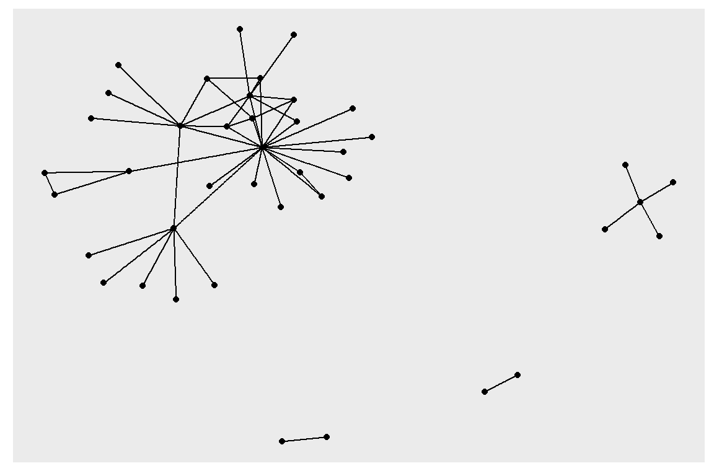
<p class="caption">(\#fig:ch6fig625)Simple first plot example using tidygraph and ggraph</p>
</div>


Now it is much easier to experiment with modifications to the node and edge parameters affecting layouts as it is not necessary to modify the underlying graph but only the plotting code (output in Figure \@ref(fig:ch6fig626)).


```r
ggraph(gt, layout = 'fr', weights = log(cooc)) + 
  geom_edge_link(color = "cyan4") + 
  geom_node_point(color = "gold4", size = 3)
```

<div class="figure" style="text-align: center">
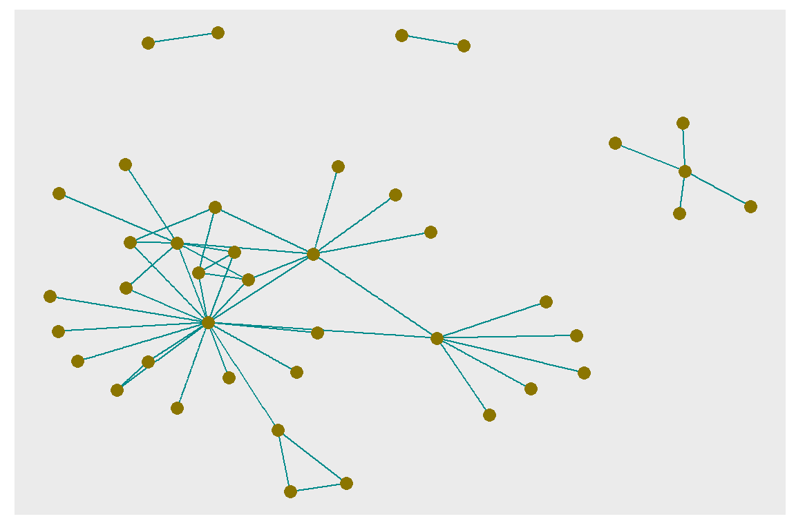
<p class="caption">(\#fig:ch6fig626)Adjusting node and edge plotting parameters</p>
</div>


### Use selected measures from _tidygraph_ and plot

We show below how to collate some of the node related measures. Some of the measures we have shown earlier using _igraph_. Now it appears in a tidy _data.frame_ or _tibble_ format.

\footnotesize

```r
node_measures <- gt %>%
     activate(nodes) %>%
     mutate(
         degree_in = centrality_degree(mode = "in"),
         degree_out = centrality_degree(mode = "out"),
         degree = degree_in + degree_out,
         betweenness = centrality_betweenness(),
         closeness = centrality_closeness(normalized = T),
         pg_rank = centrality_pagerank(),
         eigen = centrality_eigen(),
         br_score = node_bridging_score(),
         coreness = node_coreness()
     ) %>% as_tibble()
node_measures[1:10,c(1,5:10)]
```
\normalsize

Now we plot the various measures from the resulting *node_measures* _data.frame_ (output in Figure \@ref(fig:ch6fig627)).

Plot _degree_, _degree_in_, and _degree_out_ together (output in Figure \@ref(fig:ch6fig628)).

<div class="figure" style="text-align: center">
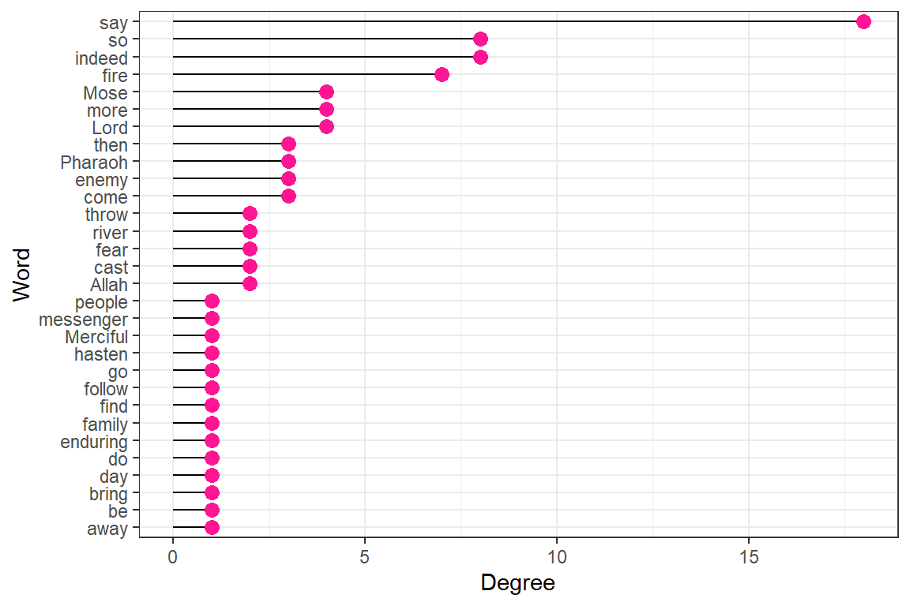
<p class="caption">(\#fig:ch6fig627)Degree for top 30 words</p>
</div>

Plot _degree_ ( _degree-in_ + _degree-out_ ) and _betweenness_ together (output in Figure \@ref(fig:ch6fig629)).

<div class="figure" style="text-align: center">
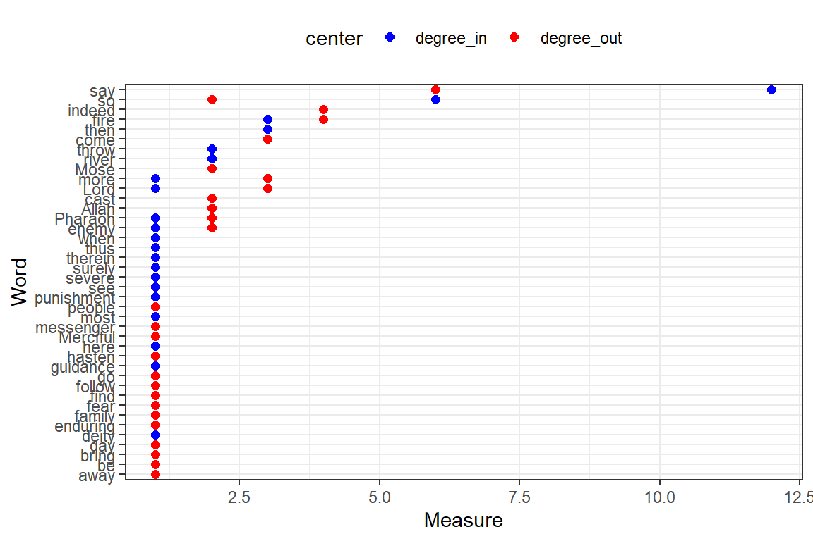
<p class="caption">(\#fig:ch6fig628)Degree-in and degree-out for top 50 words</p>
</div>

Plot _closeness_, _pg_rank_, _eigen_, _br_score_, and _coreness_ together (output in Figure \@ref(fig:ch6fig630)).

<div class="figure" style="text-align: center">
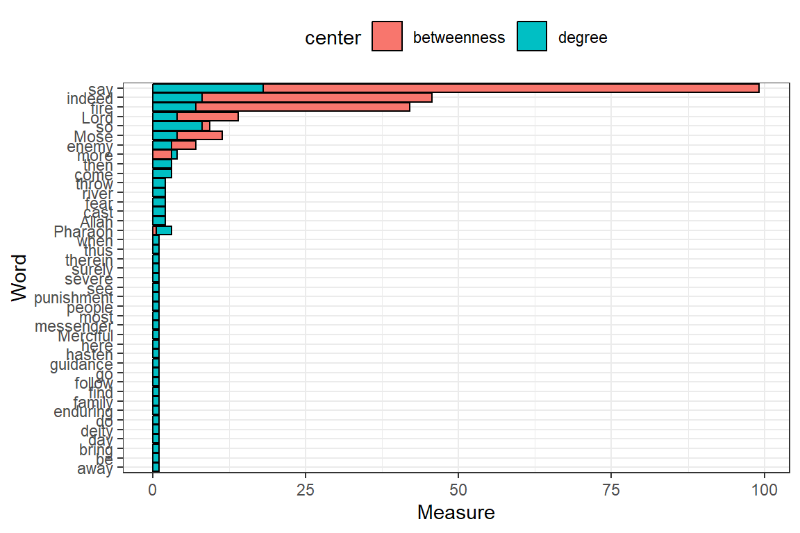
<p class="caption">(\#fig:ch6fig629)Degree and betweenness for top 50 words</p>
</div>


<div class="figure" style="text-align: center">
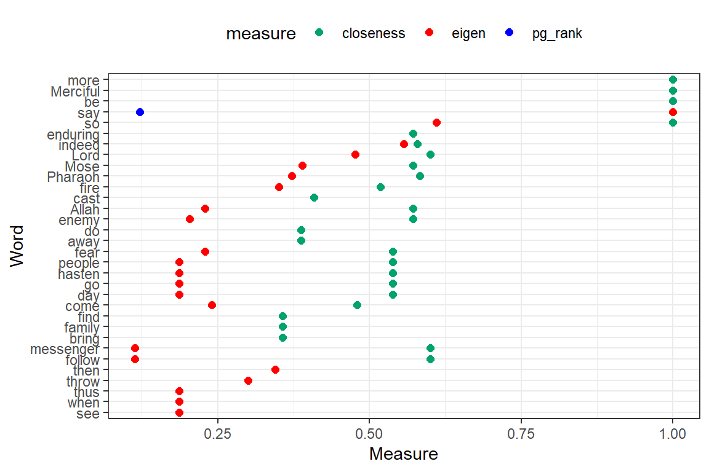
<p class="caption">(\#fig:ch6fig630)Other measures for top 50 words</p>
</div>

Despite using *coord_cartesian(ylim = c(0, 1))* to scale the Measure coordinate, the values for br_score, and coreness are 0 or very small. Without any doubt "say", "Lord" together with "Allah" and "Mose" are the most influential and important words in Surah Taa-Haa.

Notice the slight difference in using the network measures with _tidygraph_. We can easily assemble the required measures for the nodes in a tidy _data.frame_. _tidygraph_ has many functions that can give us information about nodes. We show examples of some measures that seem to measure slightly different things about the nodes.

* degree: Number of direct connections
* betweenness: How many shortest paths go through this node
* pagerank: How many links pointed to me come from a lot of pointed-to-nodes
* eigen centrality: Something like the page rank but slightly different
* closeness: How central is this node to the rest of the network
* bridge score: Average decrease in cohesiveness if each of its edges were removed from the graph
* coreness: K-core decomposition

### Example combining selected node and edge measures from _tidygraph_

The following is an interesting example in true _tidyverse_ fashion that combines some measures that we have not covered.^[https://www.shirin-glander.de/2018/03/got_network/]

\footnotesize

\normalsize

We can also convert our active node or edge table back to a _tibble_ and plot the output  (see Figure \@ref(fig:ch6fig631)).

<div class="figure" style="text-align: center">
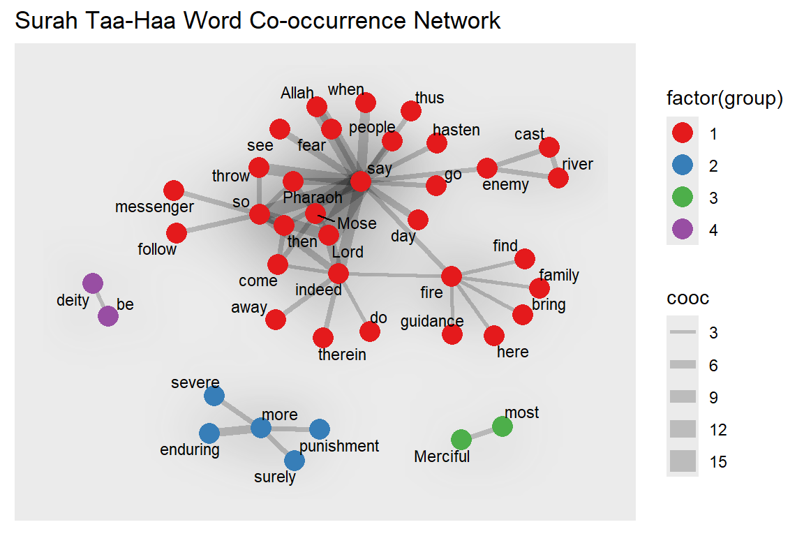
<p class="caption">(\#fig:ch6fig631)Nodes are colored by group</p>
</div>

For the next plot, we define our own specific colors. The center-most characters are in red and the distance to the center is the node size (see Figure \@ref(fig:ch6fig632)).

<div class="figure" style="text-align: center">
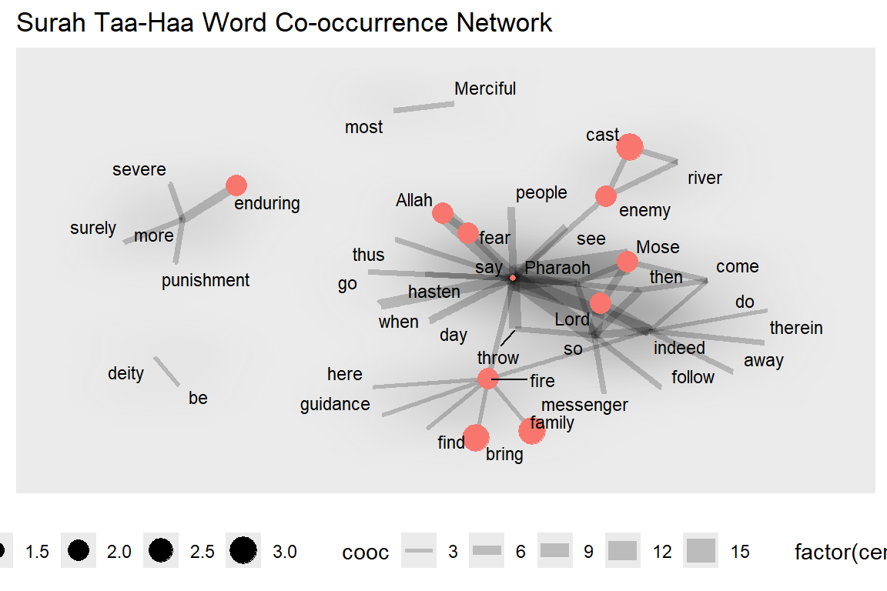
<p class="caption">(\#fig:ch6fig632)Nodes are colored by centeredness</p>
</div>

Clearly, "say" is the _keyplayer_ for the main group.

### Who is the most important influencer?

In this section, we ask some questions about which is the “most important” node. We want to understand important concepts of network centrality and how to calculate those in R.

What is the most important word in this network? What does “most important” mean? It of course depends on the definition and this is where network centrality measures come into play. We will have a look at three of these (there are many more out there).
 
**Degree centrality**: Degree centrality tells us the most connected word: it is simply the number of nodes connected to each node. It can denote Popularity. This is often the only measure given to identify “influencers”: how many followers do they have?. So far "say" has the highest, 18 (12 in and 6 out).

**Closeness centrality**: Closeness centrality tells us who can propagate information quickest. One application that comes to mind is identifying the superspreaders of infectious diseases, like COVID-19. "say" is no longer the highest.

**Betweenness centrality**: Betweenness centrality tells us who is most important in maintaining connections throughout the network: it is the number of times the node is on the shortest path between any other pair of nodes. It can denote brokerage and bridging. "say" is prominent here. As a Surah that narrates the story of Prophet Mose, that is understandable.
 
**Eigenvector Centrality**: Is a word (person) connected to other "well-connected" words (people)? It can denote connections. Again, "say" dominates.

**Diffusion Centrality**: Can a given word (person) reach many others within a short number of hops in the network? It can denote reach.

As we have seen, there is more than one definition of “most important”. It will depend on the context (and the available information) which one to choose. Based on the previous plots, without any doubt "say", "Lord" together with "Allah" and "Mose" are the most influential and important words in Surah Taa-Haa. Indeed, it is about "Allah" narrating the true story of "Mose".

### Build communities and calculate measures

We will do the analysis using _tidygraph_.

\footnotesize

```r
set.seed(123)
network_ego1 <- gt %>% 
  mutate(community = as.factor(group_walktrap())) %>%
  mutate(degree_c = centrality_degree()) %>%
  mutate(betweenness_c = centrality_betweenness(directed = F, normalized = T)) %>%
  mutate(closeness_c = centrality_closeness(normalized = T)) %>%
  mutate(eigen = centrality_eigen(directed = F))
```
\normalsize

We can easily convert it to a _data.frame_ using `as.data.frame()`. We need this to specify who is the "key player" in our ego network.

\footnotesize

```r
network_ego_df <- as.data.frame(network_ego1 %>% activate(nodes))
network_ego_df %>% slice(1:20)
```
\normalsize

__Identify the prominent word in the network__

We have converted the table_graph to a _data.frame_. The last thing we need to do is to find the top account in each centrality and pull the key player.

"Key player" is a term for the most influential nodes in the network based on different centrality measures. Each centrality has different uses and interpretations. A node that appears at the top of most centrality measures will be considered as the "key player" of the whole network.

\footnotesize

```r
# take 20 highest users by its centrality
kp_ego <- data.frame(
  network_ego_df %>% arrange(-degree_c) %>% select(name) %>% slice(1:20),
  network_ego_df %>% arrange(-betweenness_c) %>% select(name) %>% slice(1:20),
  network_ego_df %>% arrange(-closeness_c) %>% select(name) %>% slice(1:20),
  network_ego_df %>% arrange(-eigen) %>% select(name) %>% slice(1:20)
) %>% setNames(c("degree","betweenness","closeness","eigen"))
```
\normalsize

__Top 10 words based on its centrality__

From the table above, "say" tops in most centrality measures.

### Visualize the network

We scale the nodes by degree centrality, and color it by community. We filter by only showing community 1 to 10 (see output in Figure \@ref(fig:ch6fig633)).


```r
network_ego1 %>%
  filter(community %in% 1:10) %>%
  top_n(100,degree_c) %>%
  mutate(node_size = ifelse(degree_c >= 1,degree_c,0)) %>%
  mutate(node_label = ifelse(closeness_c >= 0.001,name,"")) %>%
  ggraph(layout = "stress") +
  geom_edge_fan(alpha = 0.05) +
  geom_node_point(aes(color = as.factor(community), size = 1.5*node_size)) +
  geom_node_label(aes(label = node_label),repel = T,
                 show.legend = F, fontface = "bold", label.size = 0,
                 segment.color="royalblue", fill = "wheat") +
  coord_fixed() +
  theme(legend.position = "none")
```

<div class="figure" style="text-align: center">
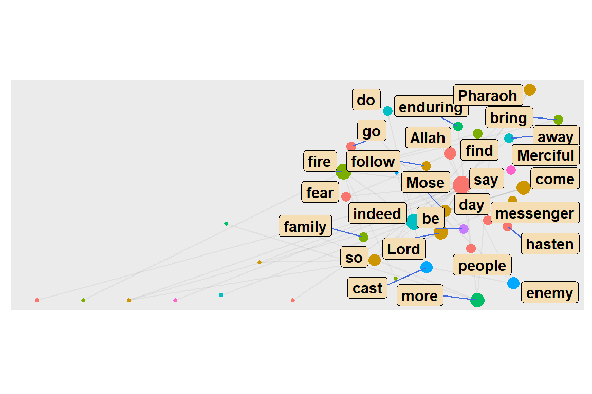
<p class="caption">(\#fig:ch6fig633)Top 10 word communities</p>
</div>

__ego() function__

The neighbors of a specific node can be extracted with the ego() function. Below, we are looking for all words that are linked with "say", directly (order = 1) and indirectly (order > 1).

\footnotesize

```r
focusnode <- which(V(gd)$name == "say")
# ego(gd,order = 1, nodes = focusnode, mode = "all", mindist = 1)[1:7]
ego(gd,order = 2, nodes = focusnode, mode = "all", mindist = 1)[1:7]
# ego(gd,order = 3, nodes = focusnode, mode = "all", mindist = 1)[1:7]
```
\normalsize

We use this to test the small world and 6 degrees concept^[http://networksciencebook.com/chapter/3#small-worlds]. Here "say" reaches every other word after 2 degrees/orders.

### Concentric layouts

We introduced some network graph layouts in Chapter 5. We discussed in more detail features about layouts, nodes, edges, and themes using the _ggraph_ package where we used the same sample network of word co-occurrences in Surah Taa-Haa.^[https://rpubs.com/azmanH/708667]  Here, we will show examples of new layouts.

Concentric circles help to emphasize the position of certain nodes in the network. The _graphlayouts_ package has two functions for concentric layouts, *layout_with_focus()* and *layout_with_centrality()*.

The first one allows to focus the network on a specific node and arrange all other nodes in concentric circles (depending on the geodesic distance) around it. Below we focus on the word "Mose". However, it must be a connected graph. From previous plots, both *gd* and *gu* is not fully connected. So we focus on the largest cluster.

__Taking the largest component__

\footnotesize

```r
cld <- clusters(gd)
jg1 <- induced_subgraph(gd, which(cld$membership == which.max(cld$csize)))
jg2 <- simplify(as.undirected(jg1))
```
\normalsize

The parameter focus in the first line is used to choose the node id of the focal node (Mose = 1). The function coord_fixed() is used to always keep the aspect ratio at one (i.e. the circles are always displayed as a circle and not an ellipse).

The function draw_circle() can be used to add the circles explicitly (see the output in Figure \@ref(fig:ch6fig634)).


```r
got_palette = c("red", "blue", "green", "gold", "coral", "cyan4",
                "maroon", "deeppink")
focusnode <- which(V(jg1)$name == "Mose")
deg = degree(jg1)
ggraph(jg1,layout = "focus", focus = focusnode) +
    graphlayouts::draw_circle(col = "darkblue", use = "focus", 
                              max.circle = 3) +
    geom_edge_link0(aes(edge_width = cooc), edge_color = "grey66") +
    geom_node_point(aes(size = deg), shape = 19, color = "hotpink") +
    geom_node_text(aes(filter = (name == "Mose"), 
                       size = 2*deg, label = name),
                       family = "serif") +
    scale_edge_width_continuous(range = c(0.1, 2.0)) +
    scale_size_continuous(range = c(1,5)) +
    scale_fill_manual(values = got_palette) +
    coord_fixed() +
    theme(legend.position = "bottom")
```

<div class="figure" style="text-align: center">
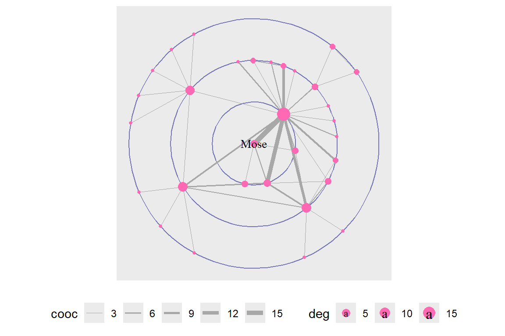
<p class="caption">(\#fig:ch6fig634)Using draw circle layout with Mose as focus node</p>
</div>

Repeat with a change of the focus node and displaying all the words (see the output in Figure \@ref(fig:ch6fig635)).

<div class="figure" style="text-align: center">
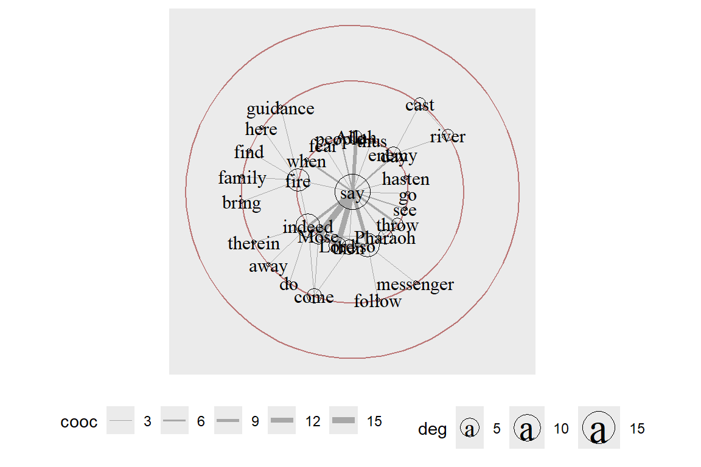
<p class="caption">(\#fig:ch6fig635)Same layout with say as focus node and text labels</p>
</div>

_layout_with_centrality()_ works similarly. We can specify any centrality index (or numeric vector) and create a concentric layout where the most central nodes are put in the center and the most peripheral nodes in the biggest circle. The numeric attribute used for the layout is specified with the cent parameter. Here, we use the weighted degree of the characters. See the output in Figure \@ref(fig:ch6fig636).

<div class="figure" style="text-align: center">
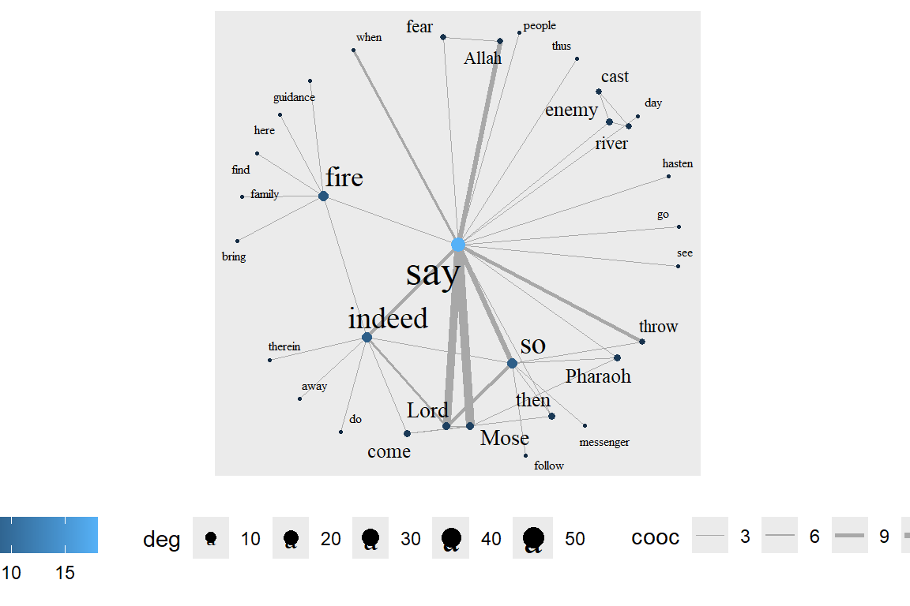
<p class="caption">(\#fig:ch6fig636)Weighted degree centrality layout</p>
</div>

We repeat with _betweenness centrality_ (see the output in Figure \@ref(fig:ch6fig637)).

<div class="figure" style="text-align: center">
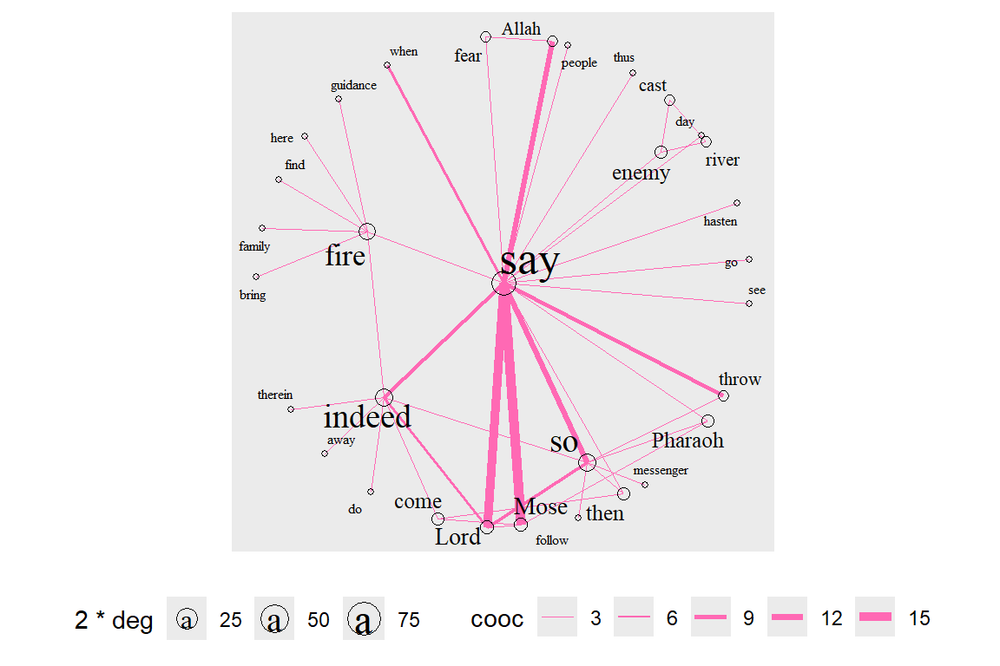
<p class="caption">(\#fig:ch6fig637)Betweenness centrality layout with degree for node size</p>
</div>

__Stress layout and clustering__

We focus again on *gd* and *gu*. Some clustering functions do not work on directed graphs. We show two different examples here. The first one is a directed network (outputs in Figure \@ref(fig:ch6fig638)).

<div class="figure" style="text-align: center">
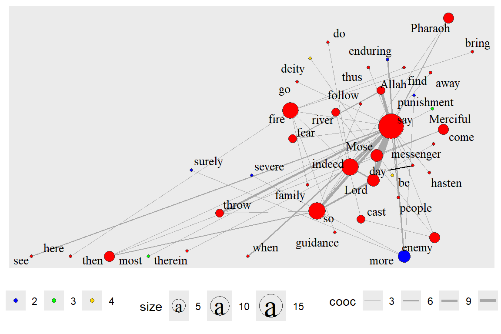
<p class="caption">(\#fig:ch6fig638)Directed network with clusters</p>
</div>

The second one is the undirected graph *gu* and *cluster_louvain* which does not work with directed graphs. *gu* does not have edge properties so we remove the aes(width=cooc). The output is in Figure \@ref(fig:ch6fig639).

<div class="figure" style="text-align: center">
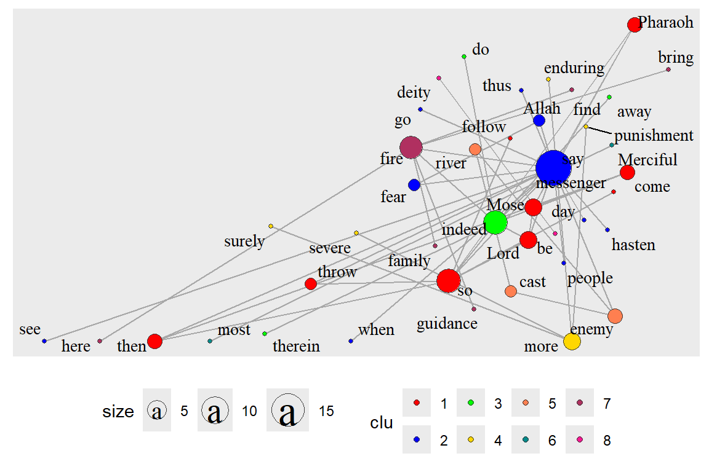
<p class="caption">(\#fig:ch6fig639)Undirected network with clusters</p>
</div>

Interestingly, the cluster functions give 4 for *gd* and 8 for *gu*.

__Focus layout and clustering - focus on selected words__

Earlier, we have shown how _layout_with_focus()_ allows us to focus the network on a specific word and order all other nodes in concentric circles (depending on distance) around it. Here we combine it with clustering. The limitation is that it can only work with a fully connected network (see the output in Figure \@ref(fig:ch6fig640) and Figure \@ref(fig:ch6fig641)).

<div class="figure" style="text-align: center">
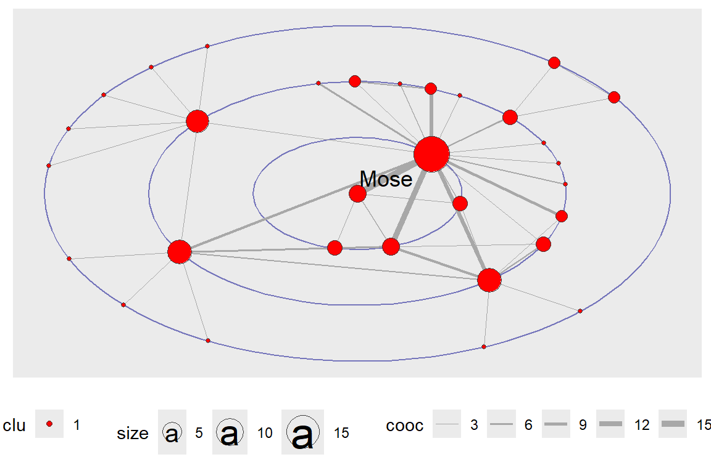
<p class="caption">(\#fig:ch6fig640)Focus layout with only the focus word</p>
</div>

<div class="figure" style="text-align: center">
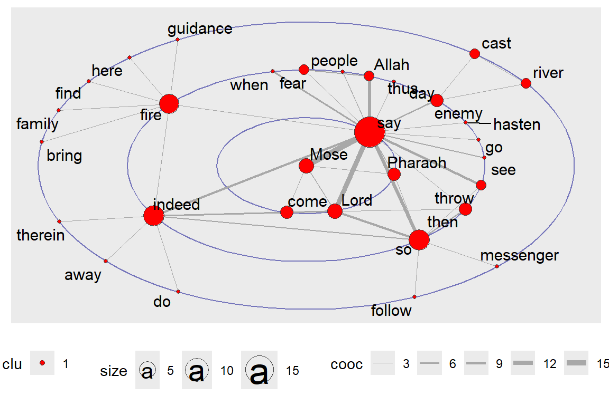
<p class="caption">(\#fig:ch6fig641)Focus layout with all words</p>
</div>

_layout_with_centrality()_ is based on a similar principle. We have shown this earlier. But here, we repeat with clustering (using *gu*) and look at the coreness centrality measure. Earlier, we have seen that _cluster_louvain()_ gives different results than _clusters()_ (see output in Figure \@ref(fig:ch6fig642) and Figure \@ref(fig:ch6fig643)).

<div class="figure" style="text-align: center">
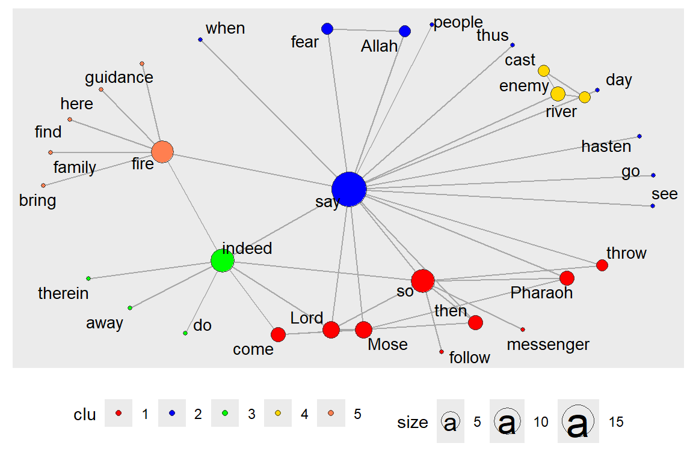
<p class="caption">(\#fig:ch6fig642)Centrality layout : graph.strength with clusters</p>
</div>

<div class="figure" style="text-align: center">
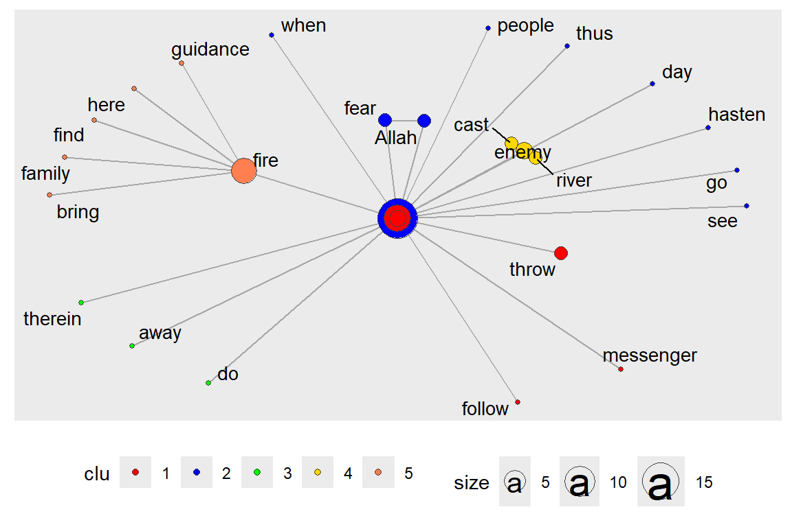
<p class="caption">(\#fig:ch6fig643)Centrality layout : graph.coreness with clusters</p>
</div>

## Summary {#chapter-6-summary}

We have covered the characteristics of networks using our example of the word co-occurrence network from Surah Taa-Haa. We showed how to use the functions from _igraph_ and _tidygraph_ that measure these characteristics. We also showed different ways to use _ggraph_ and its layout, node, and edge formats to visualize the network and its related measures.

The main objective is to understand the *position and/or importance* of a node in the network. The individual characteristics of nodes can be described by

* Degree
* Clustering
* Distance to other nodes

The *centrality* of a node reflects its influence, power, and importance. There are four different types of centrality measures.

* Degree - connectedness
* Eigenvectors - Influence, Prestige, "not what you know, but whom you know"
* Betweenness - importance as an intermediary, connector
* Closeness, Decay – ease of reaching other nodes

We summarize the use of some of these measures in simpler terms.

* Degree distributions help identify global	patterns of networks.
* Clustering helps identify local	patterns.
* Centrality measures determine the position and importance of nodes in	networks.

We ended the tutorial with examples of using _ggraph_ with the stress, layout_with_focus() and layout_with_centrality() functions from the _graphlayouts_ package. These examples will be very useful in our future work.

In concluding, we refer to some interesting points about areas of research in networks.^[https://www.coursera.org/learn/social-economic-networks]
Why	Study	Networks?

* Many	economic,	political, and social interactions are shaped	by the local structure of relationships:	
    * trade	of goods and services	
    * sharing	of information,	favors, risk
    * transmission of	viruses, opinions
    * access to	info about jobs	
    * choices	of behavior, education	
    * political	alliances, trade alliances
* Social networks	influence	behavior	
    * crime, employment, human capital, voting,	smoking
    * networks exhibit heterogeneity,	but	also have	enough underlying structure	to model	
* Pure	interest in	social structure
    * understand social network	structure	

Primary	Questions:	

* What do	we know	about	network	structure?	
* How	do networks	form?	How do	the	efficient	networks form?
* How	do networks	influence	behavior?
* Diffusion, learning, peer	effects, trade, inequality,	polarization	
* Dynamics,	feedback

What are important areas for future research?	Three	areas	for	research include:	

* Theory	
    * network	formation, dynamics, design	
    * how	networks influence behavior	
    * co-evolution?	
* Empirical	and	experimental work
    * observe	networks,	patterns,	influence	
    * test theory	and	identify regularities	
* Methodology	
    * how	to	measure	and	analyze	networks

From the items above, 

* interest in	and understanding	the Quran words	network	structure, and
* empirical	and	experimental work to observe networks, patterns, and influence

are what we can relate to with our current work on Quran Analytics.

## Further readings

Jackson, M. O. _Social and Economic Networks_, Princeton University Press, Princeton, New Jersey, USA, 2008 [@jackson2008].

Kolazcyk, E. and Csardi, G. _Statistical Analysis of Network Data with R_, Springer, New York,New York, USA, 2014 [@csardi2014].

Barebra, P., _Introduction to social network analysis with R_ (http://pablobarbera.com/big-data-upf/html/02a-networks-intro-visualization.html)

Sadler, J, _Introduction to Network Analysis with R_ (https://www.jessesadler.com/post/network-analysis-with-r/)

